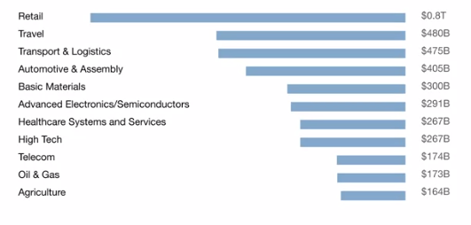

Week 1 Introduction
Table of contents:

- [Introduction](#introduction)
- [Machine Learning](#machine-learning)
- [Dataset](#dataset)
  - [Data is messy](#data-is-messy)
- [Terminalogi AI](#terminalogi-ai)
- [What make an AI Company](#what-make-an-ai-company)
  - [5 Step Internet Company Transformation to AI Company - Playbook](#5-step-internet-company-transformation-to-ai-company---playbook)
- [What AI __Can__ and __Cannot__ do.](#what-ai-can-and-cannot-do)
    - [Streght and weaknesses of machine learning](#streght-and-weaknesses-of-machine-learning)

## Introduction

- AI is estimated to create an addition **13 trillion** US dollars of values annualy by the year of 2030
- Value AI in current industry 
  
- We can separate AI into two category
  
    1.  ANI (Artificial narrow intelligence) - Smart Speaker, Self Driving car, web search
    2.  AGI (Artificial General Itelligence) - Do anything human can do

----

## Machine Learning

What type application use ML supervised ?

| Input | Output | Application |
| ------|--------|-------------|
| email| spam?(0/1) | spam filtering |
| audio | text transacript | speech recognition |
| English | Bahasa | machine translation
| Ad, user info | click ?(0/1) | online advertising |
| image, radar info | position of other cars | self driving car
| image of phone | defect?(0/1) | visual inspection |

-----

## Dataset

[cursera](https://www.coursera.org/learn/ai-for-everyone/lecture/dLSWR/what-is-data)

Data is very important in ML, but what is data really? dataset is list of data you want to process with ML, for example you want create application to detect a cat from image, then the dataset should collections of cat and not cat image.

there two way to labeling data
1. Manual labeling - you label every data with cat and not cat
2. From observing behavior from every cat image

ML dataset effected how accuracy result our application, and if we give bad/incorrect label dataset. this will give us false positive result.

### Data is messy
1. Garbage in, garbage out - if you give garbage data as dataset you will get garbage result.
2. Data Problem 
    
    - Incorrect labels
    - Missing values
  
3. Multiple types of data  - Image, Audio, Text (Unstructed data)

---

## Terminalogi AI

- Machine Learning Vs Data Science

**Machine Learning** is a system running in our website/mobile app that learn input to outputs, or A to B mappings

**Data Science** are a team  analyze our dataset in order to gain insights, So, a tam might come up with a conclusion like, 

__"hey, did you know if you have two houses of a similiar size, they've similiar square footage, if the house has three bedrooms, then they cost a lot more than the house of two bedrooms, even if the square for this is the same"__

so, these would example of data science project, where the output of a data science project is a set of insight that chn help you make business dicisions.

| Machine Learning | Data Science |
|------------------|--------------|
| Field of study gives computers the ability to learn without being explicitly programmed - Arthur Samuel (1559) | Science of extracting knowledge and insight from data |

**Deep Learning** : it is a machine learning were originally inspired by the brain, how our brain works and people sometime call it Aritificial Neural Network (ANN), but the details of how they work are almost completely unrelated to how biological brain work.

----

## What make an AI Company

[Video](https://www.coursera.org/learn/ai-for-everyone/lecture/KpuJd/what-makes-an-ai-company)

- Strategy data acquisition
- Unified data warehouse
- Pervasive automation
- New roles (MLE - Machine Learning Engineer)

### 5 Step Internet Company Transformation to AI Company - Playbook
1. Execute pilot projects to gain momentum
2. Build an in-house AI team
3. Provide board AI training
4. Develop an AI strategy
5. Develop internal and external communications

----

## What AI __Can__ and __Cannot__ do.

[Video](https://www.coursera.org/learn/ai-for-everyone/lecture/rv1fW/what-machine-learning-can-and-cannot-do)

1. Learning a "simple" concept - machine can process less than 1 second
2. Second, a machine learning problem is more likely to be feasible if you have lots of data available.

__Self-driving car__
  
- AI Can do:
 AI can take picture of what's in front of your car and maybe using a camera, maybe using other senses as well such as radar or lidar. then to figure out, what is position or where are the other cars. 

  AI where the input A, is picture front of your car and B the output where are the other cars.

- AI Cannot do:
  AI cannot do or very dificult to do. which is to input a picture and output the intention of whatever the human trying to gesture at your car. such as, construction worker tell you hole in the road, or bycle give signal left hand to indicate that they want to turn left.

__X-ray diagnosis__

- AI Can do:
  Diagnose pneumonia from ~10,000 labeled images

- AI Cannot do:
  Diagnose pneumonia from 10 images of a medical textbook chapter explaing pnuemonia

#### Streght and weaknesses of machine learning

- ML tends to work well when:

  1. Learning a "simple" concept
  2. There is lot of data available

- ML tends to work poorly when:
  
  1. Learning complex concept from small amount of data
  2. It is asked to perform on new types of data - You have AI with dataset to diagnose pneumonia and you want the same AI to diagnose other disease with new types of data.

