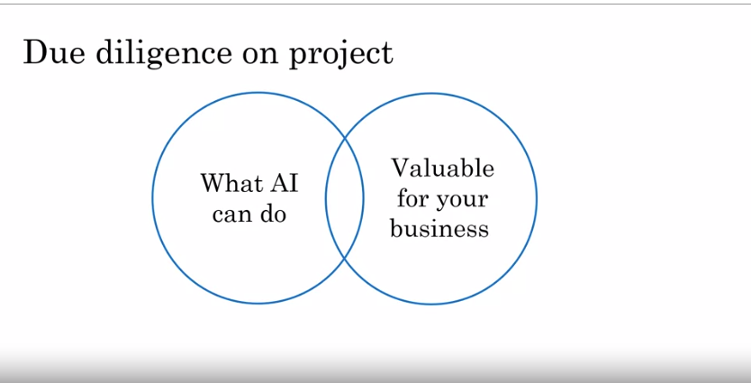

# Building AI Project

## Workflow of a machine learning project

[Video](https://www.coursera.org/learn/ai-for-everyone/lecture/z6hU1/workflow-of-a-machine-learning-project)

### The Steps

1. Collect Data
2. Train Model (use Machine Learning to input to output or A to B Mapping)
3. Deploy the model 
      
      -  Get data back maintain / update model

Example project:

__Self-driving car__:
1. Collect data - Take picture the front of cars (A) - Predict position of other cars (B)
2. Train Model - Iterate many times until good enough
3. Deploy model - Get data back, Maintain/ update model 

------

## Workflow of a data science project

[Video](https://www.coursera.org/learn/ai-for-everyone/lecture/3VpZi/workflow-of-a-data-science-project)

Unlike a machine learning project, the output of a data science project is often a set of actionable insights, a set of insights that may cause you to do things differently.

### The Steps

1. Collect data
2. Analyze data  - iterate many times to get good insights
3. Suggest hypotheses/actions
    
    - Deploy changes
    - Re-analyze new data periodically

----

## Every job function needs to learn how to use data

[Video](https://www.coursera.org/learn/ai-for-everyone/lecture/W0XsP/every-job-function-needs-to-learn-how-to-use-data)

You can change every repetitif job with AI/ML

---

## How to choose an AI project

AI knowledge and domain knowledge

- What AI can do X valuable for your business

### Brainstroming framework

1. Think about automating __tasks__ rather than automating __jobs__ - 
2. What are the main drivers of business values?
3. What are the main pain point in your business?

## You can make progress event without big data

1. Having more data almost never hurts.
2. Data makes some business (like web search) defensible.
3. But with small datasets, you can still make progress

### How to check if the idea for AI project is really worth?

this is the step you through the process that you can use to double-check if project worth that many months of effort.

__Due Diligence on project__

- __Technical diligence__ is the process of making sure that the AI system you hope to build really is doable, really is feasible. 
- __Business diligence__ is the process of thinking through carefully for the AI system that you're building such as a speech recognition system that's 95 percent accurate or a visual inspection system that's 99.9 percent accurate, would allow you to achieve your business goals.

| Technical diligence | Business diligence |
|------------------|-------------------|
| can Ai system meet desired performance| lower cost |
| How much data is needed | increase revenue |
| Engineering timeline | Launch new product or business |

__Build vs. buy__

1. ML Projects can be in-house or outsourced
2. DS projects are more commonly in-house
3. Something will be industry standard - avoid building those.

-----------

## Working with an AI team

[Video](https://www.coursera.org/learn/ai-for-everyone/lecture/74dmT/working-with-an-ai-team)

1. Specify your acceptance criteria
2. What the goal of the project
3. Provide AI team a dataset on which to measure their performance

### How AI teams think about data

 - Training Set 

     -  Learn A to B - try to figure out what model we can use
     -  
 - Test Set

     - test input and output will label we want system to give

### Pitfall: Expecting 100% accuracy

### Why its hard to get 100% accuracy?
- Limitation of ML
- Insufficient data
- Mislabeled data
- Ambigous labels

---------------

## Technical tools for AI teams

[Video](https://www.coursera.org/learn/ai-for-everyone/lecture/sSmkE/technical-tools-for-ai-teams-optional)

Framework ML:
- TensorFlow
- PyTorch
- keras
- MXNet
- CNTK
- Caffe
- PaddlePaddle
- Scikit-Learn
- R
- Weka

Research publications:
- Arxiv

## CPU vs GPU

