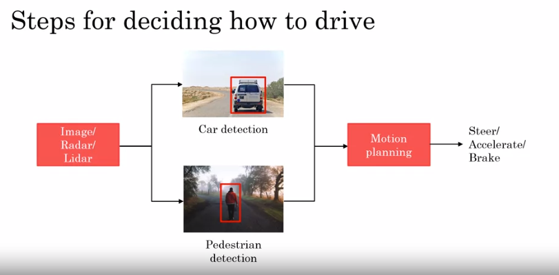

# Building AI in your Company

Table of contents:

- [Building AI in your Company](#building-ai-in-your-company)
  - [Case Study: Smart Speaker](#case-study-smart-speaker)
  - [Case study: Self-driving car](#case-study-self-driving-car)
  - [Roles of an AI team.](#roles-of-an-ai-team)
  - [AI Transformation Playbook](#ai-transformation-playbook)
  - [AI Pitfall to avoid](#ai-pitfall-to-avoid)
  - [Taking your first step in AI](#taking-your-first-step-in-ai)
  - [Survey of major AI application areas](#survey-of-major-ai-application-areas)
    - [Computer Vision](#computer-vision)
    - [Natural Language Processing](#natural-language-processing)
    - [Speech](#speech)
    - [Robotic](#robotic)
    - [General machine learning](#general-machine-learning)
  - [Survey of major AI techniques](#survey-of-major-ai-techniques)
    - [Unsupervised learning](#unsupervised-learning)
    - [Transfer learning](#transfer-learning)
    - [Reinforcement Learning](#reinforcement-learning)
    - [GANs (Generative Adversarial Network)](#gans-generative-adversarial-network)
    - [Knowledge Graph](#knowledge-graph)
  - [Google use this to define popular person](#google-use-this-to-define-popular-person)

## Case Study: Smart Speaker

command:

`Hey Device, tell me a joke`

__Step to process the command__
1. Trigger word/wakeword detection 
      -  (audio) "Hey Device?" 
2. Speech recognition
      
      - Audio -> "tell me a joke"
3. Intent recognition

    - tell me a "joke" (intent)
    - you can mapping list of intent
      - joke?
      - time?
      - music?
      - call?
      - wheater?

4. Execute joke

command:

`Hey device, set timer for 10 minutes`

__Step to process the command__
1. Trigger word/wakeword detection 
      -  (audio) "Hey Device?" 

2. Speech recognition
      
      - Audio -> "set timer for 10 minutes"

3. Intent Recognition

    -   set timer for 10 minutes -> timer

4. Extract duration

    - "set timer for `10 minutes`"
    - "let me know wen `10 minutes` is up"
5. Start Timer with set duration

other function:

1. play music
2. volume up/down
3. make a call
4. current time
5. unit conversion
6. simple question

-----------

## Case study: Self-driving car

[Video](https://www.coursera.org/learn/ai-for-everyone/lecture/lekja/case-study-self-driving-car)

Step for deciding how to drive

Image/Radar/Lidar -> Car Detection & Pedestrian detection -> `Motion planning` -> Steer/Accelerate/Break

Key steps:

1. Car detection - check camera in front, left and other side 
2. Pedestrian detection 
3. Motion planning: this is a piece of software tell you what is the path, shown here in red, you should drive in order to follow the road and not have an accident.  So the motion planning software's job is to output the path as well as speed at which you should drive your car in order to follow the road, and the speed should be set so that you don't run into the other car, but you also drive at a reasonable speed on this road.

Complete step for deciding how to drive

---------------

## Roles of an AI team.

[Video](https://www.coursera.org/learn/ai-for-everyone/lecture/FlPw6/example-roles-of-an-ai-team)

1. Software Engineer - to make the software
2. Machine Learning Engineer - Collect data, train ML
3. Machine Learning Researcher - Extend state-ofthe-art in ML
4. Data Scientist - Examine data and provide insights
5. Data Engineer - Organize data, Make sure data is saved in an easily accessible, secure and cost effective way
6. AI product manager - Help decide what to build; what's feasible and valuable

----

## AI Transformation Playbook

[Video](https://www.coursera.org/learn/ai-for-everyone/lecture/02931/ai-transformation-playbook-part-1)

In this video andre ng talk about how to transform our company into AI company with playbook he create when work for Google & Baidu

Playbook 

1. Execute pilot projects to gain momentum 
   - More important for the intial project to succeed rather than be the most valueable
   - Show traction within 6 - 12 months
   - Can be in-house or be outsourced
2. Build an in-house AI team
   - AI team should help with existance team to improve the product.
   - Build data infrastructure aggregate data from exists Business Unit 
3. Prove broad AI training
   
   | Role | What they should learn |
   |------|------------------------|
   |Executive and senior business leaders |  1. What AI can do for your enterprise  3. AI Strategy  2. Resource Allocation
    |
    | Leader of division working on AI projects | 1. set project direction (technical and business diligence)  2. Resource Allocation 3. Monitor Progress|
    | AI Engineer trainees | 1. Build and ship AI software 2. Gather data 3. Execute specific AI projects

4. Develop an AI strategy
   - Leverage AI to create advantage spesific to your industry sector
   - You should create strategy from data your get from step 1 
   - Design strategy aligned with the "Virtous Cycle of AI"
   - Develop AI spesific for your industry
   - Consider creating a data strategy
     - Strategic data acquisition
     - Unified data warehouse
   - Create network effect and platform advantages
     - In industries with "winner take all" dynamic AI can b an accelartor
5. Develop internal & external communications
   - Investor relations
   - Goverment relations for medical industry or any other rigid field
   - Consumer/user education
   - Talent/recruitment
   - Internal communications

-----------

## AI Pitfall to avoid

Five do and dont AI projects

| Don't | Do: |
|-------|-----|
| Expect AI to solve everything | Be realistic about what AI can and cannot do given limitations of technology, data and engineering resources | 
| Hire 2-3 ML and count solely on them to come up with the use cases | Pair engineering talent with business talent and work corss-functionally to find feasible and valuable projects |
| Expect AI to work the first time | Plan for AI development to be an iterative process, with multiple attempts needed to succeed |
| Expect traditional planning processes to apply without changes |  Work with AI team to establish timeline estimates, milestones, KPIs etc |
| Think you need superstar AI engineers before you can do anything | keep building the team, but get going with the team you have |

----

## Taking your first step in AI

[video](https://www.coursera.org/learn/ai-for-everyone/lecture/5aOMz/taking-your-first-step-in-ai)

- Get friends to learn about AI
  - This course
  - Reading group
- Start brainstroming projects
  - No projct is to small
  - Start small and succeed instead big and failed
- Hire a few ML/DS people to help
- Hire or appoin an AI leader (VP AI)
- Discuss with CEO/Board posibilities of AI Transformation
  - **Will your company be much more valuable and/or more effective if it were good at AI**

----------

## Survey of major AI application areas

[video](https://www.coursera.org/learn/ai-for-everyone/lecture/dJEM7/survey-of-major-ai-application-areas-optional)

What ML used in real life applications?

### Computer Vision

- Image classification/Object recognition 
  - Input image of cat # user
  - Output this a cat # machine
- Face recognition - Recognition person face from train Dataset
- Object detection 
  - Detect object in image and the position 
  - Self Driving car will take us input an image and tell us where in the picture different objects are as was what are the types of those objects (car, pedestrian)
- Image segmentation
  - Reading x-ray scan, ML will tell us where the liver, where the heart in this image
  - Tracking - we can track people running across several second in the video

### Natural Language Processing

refers to AI Understand natural language meaning we can comunicate withh machine.

- Text classifaction
  - we input email and AI tell us is email span or non-spam
  - Product descrition and AI tell use what category this production
  - **Sentiment recognition** - AI can what sentiment from the text
- Information retrieval
  - Web sarch
- Name entity recognition
  - AI can tell us person, location, company & country name in sentence
- Machine translation
  - Google Translate
- Others: parsing, part-of-speech-tagging.

### Speech

- Spech recognition (speech to text)
  - define word by word audio
- Trigger word/wakeword detection
- Speaker ID
  - Speaker ID is a specialized speech problem where the task is to listen to someone and figure out the identity of the speaker.
- Speech sysnthesis (text-to-speech, TTS)
  - Turning text to speech
  
### Robotic
- Perception: figure out what is the world around you 
- Motion planning: finding a path for the robot to follow
- Control: sending command to motors to follow a path

### General machine learning

-  Unstructured data (image, audio, text)
-  Structured data 

--------------------

## Survey of major AI techniques

[video](https://www.coursera.org/learn/ai-for-everyone/lecture/qxMIm/survey-of-major-ai-techniques-optional)

There are a lot of AI and machine learning techniques today. And while supervised learning, that is learning A to B mappings, is the most valuable one, at least economically today, there are many other techniques that are worth knowing about.

### Unsupervised learning

- Clustering
  - A clustering algorithm looks at data like this, and automatically group the data into two clusters or more clusters , and is commonly used for market segmentation.

### Transfer learning

Learn from task A, and use knowledge to help on Task B. 

example:
We train AI to detect __sedan car__ in image in A City and in B city there are __golf car__ dringin around in the city, **Transfer learning** make AI knowldege __golf car__ from previous tasl.

### Reinforcement Learning

Use a "reward signal" to tell te AI when it is doing well or pooly, It automatically learns to maximize its rewards.

### GANs (Generative Adversarial Network)

Synthesize new images from scratch

### Knowledge Graph

Google use this to define popular person
--------------------