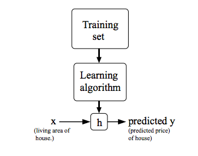
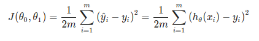
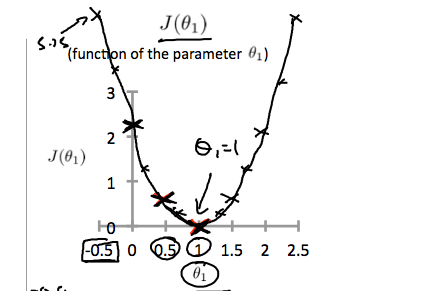
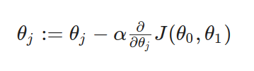
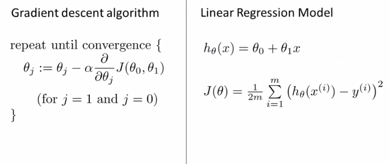
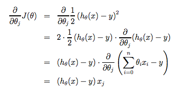
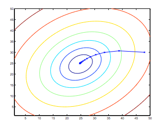
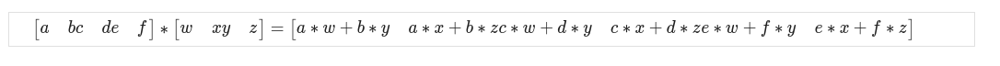

# Week 1 - Model and Const Function

This week i learn what model, cost function & basic algorithm we can use in machine learning and how use Linear regression

Table of contents:

- [Week 1 - Model and Const Function](#week-1---model-and-const-function)
  - [Model Representation](#model-representation)
    - [How do we represent h?](#how-do-we-represent-h)
  - [Cost Function](#cost-function)
  - [Cost Function - Intuition I](#cost-function---intuition-i)
  - [Cost  Function - Intuiton II](#cost--function---intuiton-ii)
  - [Gradient Descent Algorithm](#gradient-descent-algorithm)
  - [Gradient Descent Intuition](#gradient-descent-intuition)
  - [Gradient Descent For Linear Regression](#gradient-descent-for-linear-regression)
- [Review:](#review)
  - [Review: Linear Regression with One Variable](#review-linear-regression-with-one-variable)
  - [Addition and Scalar](#addition-and-scalar)
  - [Matrix vector multiplication](#matrix-vector-multiplication)
    - [Code](#code)
  - [Matrix Matrix Multiplication](#matrix-matrix-multiplication)
    - [Code](#code-1)
  - [Matrix Multiplication Properties](#matrix-multiplication-properties)
    - [Code](#code-2)
  - [Inverse and Transpose](#inverse-and-transpose)

[PDF Lecture](slide_lecture_model_n_cost_function.pdf)

## Model Representation

Notation we use in entire course:
- m = Number of traning examples
- x's = "input" variable/features
- y's = "output" variable / "target" variable
- (x, y) = one training examplem and the dataset that we'll be using to learn
- (x[i], y[i]);i = 1...m - its called training set - i __th__ training example, [i] defined the index input or output data
- h = hypothesis is a maps from x's to y's , it take input and create output for estimated value


### How do we represent h?



h(x) -> y 

Linear regression with one variable. (x) Univariate(one variable) linear regression.

When the target variable that we're trying to predict is countinoues, such as in our house example, we call the learning proble a regression probile. 

When y can take on only a small number of discrete values (such as if, given the living area, we wanted to predict if a dweling is a house or a apartment, say), we call it  a classification problem.

-----------


## Cost Function

[doc](https://www.coursera.org/learn/machine-learning/supplement/nhzyF/cost-function)

Const function will let us figure out how to fit the best possible straight line to our data.

We can measure the accuracy of our hypothesis function by using a **cost function**. 
This takes an average difference(actually a fancier version of an average) of all the results of the hypothesis with input from x's and the  actual outpus y's.




To break it apart, it is `1/2x` where `x` is the mean of squares of h($\theta$) (x[i]) - y[i], or the difference the predicted value and the actual value.


This function is otherwise called the "Squared error function", or "Mean squared error". The mean is haved (1/2) as a convenience for computation of the gradient descent, as the derivative term of the square function will cancel out the `1/2` term. Th following image summarize what the const function does.


<small>Image: formula cost function summarize </small>


NOTE: $\theta$(theta) is the weight of our function.
It can be initialized in various ways, in general it is randomized.
After that, the training data is used to find the most accurate value of theta.

Then you can feed new data to your function and it will use the training value of theta to make a prediction.

---------------------

## Cost Function - Intuition I

[doc](https://www.coursera.org/learn/machine-learning/supplement/u3qF5/cost-function-intuition-i)

If we try to think of it in visual terms, our training data set is scattered on the x-y plane. We are trying to make a straight line (defined by h($\theta$)(x)) which passes through these scattered data points.

Our objective is to get the best posible line. the best posible line will be such so that the average squared vertical distances of the scattered points from the line will the least. ideally, the line should pass through all the points of our training data set. In such a case, the value of `J(0[0], 0[1])` will be 0, The following example shows the ideal situation where we hae a cost function of 0.


When `0[1]=1`, we get a slope of which goes through every single data point in our model. Conversely, when `0[1] = 0.5`, we see the vertial distance from our fit to the data points increase.


Th increases our cost function to 0.58. Plotting several other points yeilds to the following graph:



Thus as a goal, we should try to minimize the cost function. In this case `0[1] = 1` is our global minimum


-------

## Cost  Function - Intuiton II

[video](https://www.coursera.org/learn/machine-learning/lecture/nwpe2/cost-function-intuition-ii)
[doc](https://www.coursera.org/learn/machine-learning/supplement/9SEeJ/cost-function-intuition-ii)

NOTE: read about contour figure,  i still not fully understand this part :/

--------

## Gradient Descent Algorithm

[video](https://www.coursera.org/learn/machine-learning/lecture/8SpIM/gradient-descent)

Gradient descent its used for minimizing some arbitary function J (const function) and other function in next course.

Problem Setup

Have some function J($\theta$[0], $\theta$[1])
Want min J($\theta$[0], $\theta$[1])

__Outline__ :
- Start with some $\theta$[0], $\theta$[n]
- Keep changing $\theta$[0] $\theta$[1] to reduce J($\theta$[0], $\theta$[1]) until we hopefully end up at a minimum


The gradient descent algorithm is:

repeat until convergence:



where 

- J=0,1 represents the feature index number.
- Alpha $\alpha$ term is called the learning rate. And it controls how - big a step we take when updating my parameter theory J.


At each iteration J, one should simultaneously update the parameters $\theta$[1], $\theta$[2],..$\theta$[n]. 

Updating a spesific parameter
prior to calculating another one on the J(th) iteration would yield to a wrong implementation.


 
## Gradient Descent Intuition
 
 [video](https://www.coursera.org/learn/machine-learning/lecture/GFFPB/gradient-descent-intuition)
 [doc](https://www.coursera.org/learn/machine-learning/supplement/QKEdR/gradient-descent-intuition)
 
 
 ## Gradient Descent For Linear Regression

[video](https://www.coursera.org/learn/machine-learning/lecture/kCvQc/gradient-descent-for-linear-regression)
[doc](https://www.coursera.org/learn/machine-learning/lecture/kCvQc/gradient-descent-for-linear-regression)




Gradient descent algorithm


```
repeat until convergence: {
  θ0:= θ0 − α 1/m ∑i=1m(hθ(xi)−yi)

  θ1:= θ1 − α 1/m ∑i=1m((hθ(xi)−yi)xi)
}

```
Where m is the size of training set (length matrix), $\theta$0 constant that will be changing simultaneously with $\theta$1 and `x[i]`,`y[i]` are values of the given training set (data).

Note that we have seperated out the two cases for $\theta$j into separata equations for $\theta$0 and $\theta$1; and that for $\theta$1 we are muliplying `xi` at the end due to the derivative. The following is a derivation of $\alpha$/$\alpha$$\theta$j J($\theta$) for single example:



The point of all this is that if we start with a guess for our hypothesis and then repeatedly apply these gradient descent equations, our hypotesis will become more and more accurate.

So, this is simply gradient descent on te original const function `J`. This method looks at every example in the entire training set on every step, and is called __batch gradient descent__. Note that, while gradient descent can be susceptible to local minima in general, the optimization problem we have posed here for linear regression has only one global, and no other local, optima; thus gradient descent always converges (assuming the learning rate $\alpha$ is not too large) to the global minimum. Indeed, J is convex quadratic function. Here is an example of gradient descent as it is run to minimize a quadratic function.



The ellipses shows above are the contours of a quadratic function. Also shown is the trajectory/litasan taken by gradient descent, which was initialized at (48,30). The x's in the figure (joined by staight lines) mark the successive values of $\theta$ that gradient descent went through as it converged to its minimum.

# Review:

## Review: Linear Regression with One Variable

Matrices are 2-dimensional arrays
Vectors are a subset of matrices


Matrices: Rectangular arrays of numbers:

```
[ 
  1 2 3
  4 5 6
]

definition of matrix above:

rows = 2
columns = 3
dimension = 2
```
Dimension of matrix: number of rows x number of columns


Vectors is a matrix with one column and many rows:
` [wxyz] `


Notation and terms:

- A_{ij}A ij refers to the element in the ith row and jth column of matrix A.
- A vector with 'n' rows is referred to as an 'n'-dimensional vector.
- v_iv i refers to the element in the ith row of the vector.
- In general, all our vectors and matrices will be 1-indexed. Note that for some programming languages, the arrays are 0-indexed.
- Matrices are usually denoted by uppercase names while vectors are lowercase.
- "Scalar" means that an object is a single value, not a vector or matrix.

- Rrefers to the set of scalar real numbers.
- R^n refers to the set of n-dimensional vectors of real numbers.


```R

# initialize new vector with 1 row and 12 columns
A  <- c(1, 2, 3, 4,5,6,7,8,9,10,11,12)

# initialize new vector with 1 row and 3 columns
B  <- c(20,21,22)

# initialize matrix with 2 rows and 4 column
C <- array(c(A, B), dim = c(2,4))
print(A[12])
print(C)

```

## Addition and Scalar

[doc](https://www.coursera.org/learn/machine-learning/supplement/FenyC/addition-and-scalar-multiplication)
[code in Mathlab](./week1_assets/review_addition_scalar_multiplication.m)


## Matrix vector multiplication

We map the column of the vector onto each row of the matrix, multiplying each element and summing the results.

```

[a , bc, de ,f] * [xy] = [a * x + (b * y) (c * x) + d * ye * x  + f * y] 

```

The results is a vector. The number of columns of matrix must equal the rows of the vector.

An __m * n matrix__ multiplied by an __n * 1 vector__ results in an __m x 1 vector__.

Below is an example of a matrix-vector multiplication. Make sure you understand how the multiplication works. Feel free to try different matrix vector multiplications.


### Code
- [Code in Mathlab](./week1_assets/matrix_vector_multiplication.m)
- [Code in Golang](./week1_assets/go/main.go)
- [Code in Python](./week1_assets/phyton/matrix_multiplication.py)

-------------------

## Matrix Matrix Multiplication

We multiply two matrices by breaking it into several vector multiplications and concatenating the result.



### Code
- [Code in Python](./week1_assets/phyton/matrix_matrix_multiplication.py)

-----------------

## Matrix Multiplication Properties

[video](https://www.coursera.org/learn/machine-learning/lecture/W1LNU/matrix-multiplication-properties)

- Matricies not commutative, that mean you can swap/reverse order value between two matrix.
- Matricies are associative `(A*B)*C = A*(B*C)`


__Identity Matrix__, when m

Deonted I or `I(x * n)`, when multiplied of the same dimensions, results in the original matrix. it's just like multiplying number by i. the identity matrix simply has 1's on diagonal (upper left to lower right diagonal) and 0's wlsewhere

```
[1 0 00, 00 0 1]
```

When multiplying the identity matrix after some matrix (A * i), the square identity matrix's dimension should match the other matrix's columns. When multiplying the identiy matrix before some other matrix (I*A) the square Identy matrix's dimension should match the other matrix's __rows__:

### Code 
- [Code in Mathlab](./week1_assets/identiy_matrix.m)


------

## Inverse and Transpose


The __Inverse__ of a matrix A is noted `A^-1`. Mulplyinh by the inverse result in the identity matrix.

A non square matrix does not have an inverse matrix. We can compute inverses of matrices in octave(software) with the  `pinv(A)` functoin and in Matlab with the `inv(A)` function. Matrices that don't have an inverse are singular or deegenrate.

code in octave

```python
A = [3 4; 2 16]
A =

    3    4
    2   16

>> pinv(A)
ans =
   0.400000  -0.100000
  -0.050000   0.075000

```

The `Transposition` of a matrix is like rotating the matrix 90 derajat searah jarum jam lalu memutar nya. We can compute transposition of matrices in matlab with the transpose(A) function or A':


```
A = [a bc de f]
```

```
At = [a c eb d f]
```


code in octave
```python

D = [1,2,0; 3,5,9]
D =

   1   2   0
   3   5   9

>> transpose(D)
ans =

   1   3
   2   5
   0   9
```
