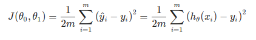
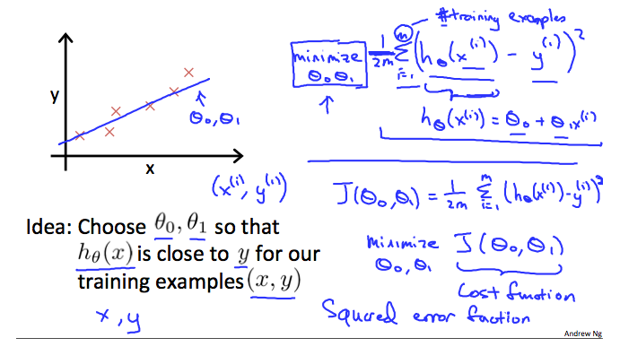
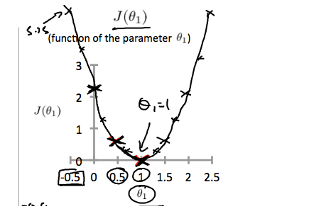
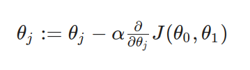
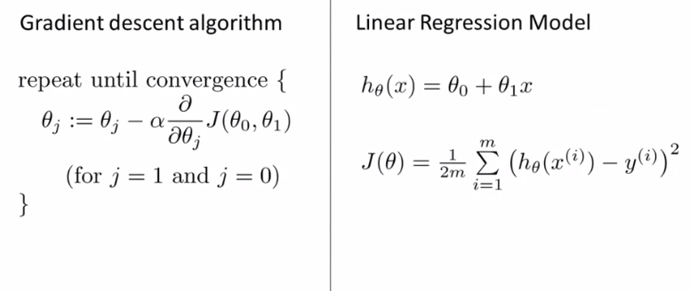
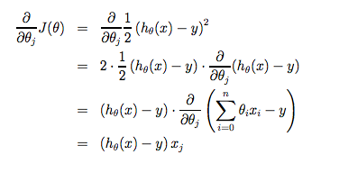
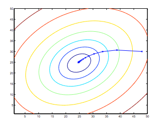

# Model and Const Function

Table of contents:

- [Model and Const Function](#model-and-const-function)
  - [Model Representation](#model-representation)
    - [How do we represent h?](#how-do-we-represent-h)
  - [Cost Function](#cost-function)
  - [Cost Function - Intuition I](#cost-function---intuition-i)
  - [Cost  Function - Intuiton II](#cost-function---intuiton-ii)
  - [Gradient Descent Algorithm](#gradient-descent-algorithm)
  - [Gradient Descent Intuition](#gradient-descent-intuition)
  - [Gradient Descent For Linear Regression](#gradient-descent-for-linear-regression)

[PDF Lecture](slide_lecture_model_n_cost_function.pdf)

## Model Representation

Notation we use in entire course:
- m = Number of traning examples
- x's = "input" variable/features
- y's = "output" variable / "target" variable
- (x, y) = one training examplem and the dataset that we'll be using to learn
- (x[i], y[i]);i = 1...m - its called training set - i __th__ training example, [i] defined the index input or output data
- h = hypothesis is a maps from x's to y's , it take input and create output for estimated value


### How do we represent h?


h(x) -> y 

Linear regression with one variable. (x) Univariate(one variable) linear regression.

When the target variable that we're trying to predict is countinoues, such as in our house example, we call the learning proble a regression probile. 

When y can take on only a small number of discrete values (such as if, given the living area, we wanted to predict if a dweling is a house or a apartment, say), we call it  a classification problem.

-----------


## Cost Function

[doc](https://www.coursera.org/learn/machine-learning/supplement/nhzyF/cost-function)

Const function will let us figure out how to fit the best possible straight line to our data.

We can measure the accuracy of our hypothesis function by using a **cost function**. 
This takes an average difference(actually a fancier version of an average) of all the results of the hypothesis with input from x's and the  actual outpus y's.




To break it apart, it is `1/2x` where `x` is the mean of squares of h($\thetha$) (x[i]) - y[i], or the difference the predicted value and the actual value.


This function is otherwise called the "Squared error function", or "Mean squared error". The mean is haved (1/2) as a convenience for computation of the gradient descent, as the derivative term of the square function will cancel out the `1/2` term. Th following image summarize what the const function does.



---------------------

## Cost Function - Intuition I

[doc](https://www.coursera.org/learn/machine-learning/supplement/u3qF5/cost-function-intuition-i)

If we try to think of it in visual terms, our training data set is scattered on the x-y plane. We are trying to make a straight line (defined by `h(thetha)(x)`) which passes through these scattered data points.

Our objective is to get the best posible line. the best posible line will be such so that the average squared vertical distances of the scattered points from the line will the least. ideally, the line should pass through all the points of our training data set. In such a case, the value of `J(0[0], 0[1])` will be 0, The following example shows the ideal situation where we hae a cost function of 0.


When `0[1]=1`, we get a slope of which goes through every single data point in our model. Conversely, when `0[1] = 0.5`, we see the vertial distance from our fit to the data points increase.


Th increases our cost function to 0.58. Plotting several other points yeilds to the following graph:



Thus as a goal, we should try to minimize the cost function. In this case `0[1] = 1` is our global minimum


-------

## Cost  Function - Intuiton II

[video](https://www.coursera.org/learn/machine-learning/lecture/nwpe2/cost-function-intuition-ii)
[doc](https://www.coursera.org/learn/machine-learning/supplement/9SEeJ/cost-function-intuition-ii)

NOTE: read about contour figure,  i still not fully understand this part :/

--------

## Gradient Descent Algorithm

[video](https://www.coursera.org/learn/machine-learning/lecture/8SpIM/gradient-descent)

Gradient descent its used for minimizing some arbitary function J (const function) and other function in next course.

Problem Setup

Have some function J($\theta$[0], $\theta$[1])
Want min J($\theta$[0], $\theta$[1])

__Outline__ :
- Start with some $\theta$0, $\thehta$
- Keep changing $\theta$[0] $\theta$[1] to reduce J($\theta$[0], $\theta$[1]) until we hopefully end up at a minimum


The gradient descent algorithm is:

repeat until convergence:



where 

- J=0,1 represents the feature indx number.
- Alpha $\alpha$ term is called the learning rate. And it controls how - big a step we take when updating my parameter theory J.


At each iteration J, one should simultaneously update the parameters $\theta$[1], $\theta$[2],..$\theta$[n]. 

Updating a spesific parameter
prior to calculating another one on the J(th) iteration would yield to a wrong implementation.


 
## Gradient Descent Intuition
 
 [video](https://www.coursera.org/learn/machine-learning/lecture/GFFPB/gradient-descent-intuition)
 [doc](https://www.coursera.org/learn/machine-learning/supplement/QKEdR/gradient-descent-intuition)
 
 
 ## Gradient Descent For Linear Regression

[video](https://www.coursera.org/learn/machine-learning/lecture/kCvQc/gradient-descent-for-linear-regression)
[doc](https://www.coursera.org/learn/machine-learning/lecture/kCvQc/gradient-descent-for-linear-regression)




Gradient descent algorithm


```
repeat until convergence: {
  θ0:= θ0 − α 1/m ∑i=1m(hθ(xi)−yi)

  θ1:= θ1 − α 1/m ∑i=1m((hθ(xi)−yi)xi)
}

```
Where m is the size of training set (length matrix), $\theta$0 constant that will be changing simultaneously with $\theta$1 and `x[i]`,`y[i]` are values of the given training set (data).

Note that we have seperated out the two cases for $\theta$j into separata equations for $\theta$0 and $\theta$1; and that for $\theta$1 we are muliplying `xi` at the end due to the derivative. The following is a derivation of $\alpha$/$\alpha$$\theta$j J($\theta$) for single example:



The point of all this is that if we start with a guess for our hypothesis and then repeatedly apply these gradient descent equations, our hypotesis will become more and more accurate.

So, this is simply gradient descent on te original const function `J`. This method looks at every example in the entire training set on every step, and is called __batch gradient descent__. Note that, while gradient descent can be susceptible to local minima in general, the optimization problem we have posed here for linear regression has only one global, and no other local, optima; thus gradient descent always converges (assuming the learning rate $\alpha$ is not too large) to the global minimum. Indeed, J is convex quadratic function. Here is an example of gradient descent as it is run to minimize a quadratic function.



The ellipses shows above are the contours of a quadratic function. Also shown is the trajectory/litasan taken by gradient descent, which was initialized at (48,30). The x's in the figure (joined by staight lines) mark the successive values of $\theta$ that gradient descent went through as it converged to its minimum.
