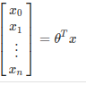
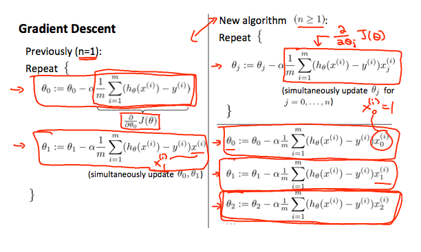
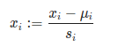
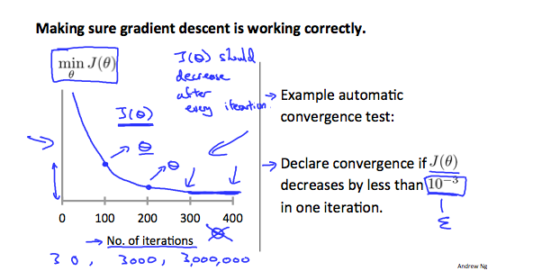
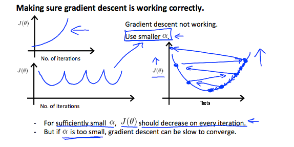
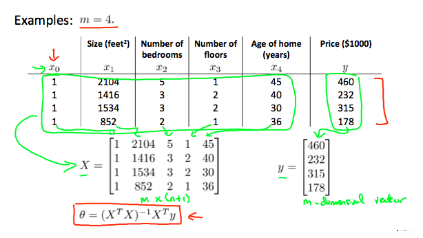

# Week 2

In this week i learn how to use gradient descent with multiple variable in linear regression and normal equation.

[PDF Lecture](./week2_assets/ml_week2_lecture_slide.pdf)

Table of contents

- [Week 2](#week-2)
  - [Multiple Features](#multiple-features)
  - [Gradient Descent For Multiple Variables](#gradient-descent-for-multiple-variables)
    - [Gradient Descent in Practice 1 - Feature Scaling](#gradient-descent-in-practice-1---feature-scaling)
    - [Gradient descent in practice II : Learning Rate](#gradient-descent-in-practice-ii--learning-rate)
    - [Feature and Polynomial Regression](#feature-and-polynomial-regression)
  - [Normal Equation](#normal-equation)
    - [Normal Equation Noninvertibiliy](#normal-equation-noninvertibiliy)


----------------------

## Multiple Features

[video](https://www.coursera.org/learn/machine-learning/lecture/6Nj1q/multiple-features)
[doc](https://www.coursera.org/learn/machine-learning/supplement/WKgbA/multiple-features)


Linear regression with multiple variables is also known as "multivariate linear regression"

We now introduce notation for equations where we can have any number of input variables.


- `x`<sup>(i)</sup><sub>j</sub> = value of featurs `j` in i<sup>th</sup> training example
- `x`<sup>(i)</sup> = the input (features) of the `i`<sup>th</sup> training example
- `m` = the number of training examples
- `n` = the number of features

The multivariable form of the hypothesis function acommodating these multiple features is as follow:

`h`<sub>$\theta$</sub>(`x`) = $\theta$<sub>0</sub> + $\theta$<sub>1 x1</sub> + ... + $\theta$<sub>n xn</sub>

In order to develop intuition about this function,  we can think about $\theta$<sub>0</sub> as the basic price of a house, $\theta$<sub>1</sub> as the price per square meter, $\theta$<sub>2</sub> as the price per floor, etc. `x`<sub>1</sub> will be the number of square meters in the house, `x`<sub>2</sub> the number of floors, etc.

Using the defintion of matrix multiplicatoin, our multivariable hpothesis function ca be concisely represented as:

`h`<sub>$\theta$</sub>(`x`) = [ $\theta$<sub>0</sub>  $\theta$<sub>1</sub>   .... $\theta$<sub>0n</sub>  ] = transpose 

This is a vectorization of our hypothesis function for one training example; see the lessons on vectorization to learn more.

Remark: Note that for convenience reason in this course we assume - `x`<sup>(i)</sup><sub>0</sub> = i for (i SUM 1,,,,m). This allows us to do matrix operations with theta and x. Hence making the two vectors `$\theta$ and `x`<sup>(i)</sup> match each other element-wise (that is, have the same number of elements: n+1)

-----

## Gradient Descent For Multiple Variables

[docs](https://www.coursera.org/learn/machine-learning/supplement/aEN5G/gradient-descent-for-multiple-variables)

The gradient descent equation itself is generally the same form; we just have to repeat it four our 'n' features:


The following image compares gradient descent with one variable to gradient descent with multiple variables:




----

### Gradient Descent in Practice 1 - Feature Scaling

We can speed up gradient descent by having each of our input values in roughly the same range. This is because $\theta$ will descend quickly on small range and slowly on large ranges, and so will oscilate inefficiently down to the optimum when the variables are very uneven.

The way to prevent this is to modify the ranges of our input variables so that they are all roughly the same. Ideally:

-1 <= `x`<sub>(i)</sub> <= 1

or 

-0.5 <= `x`<sub>(i)</sub> <= 0.5

These aren't exact requirements; we are only tring to speed things up. The goal is to get all input variables into roughly one of the ranges, give or the a few.

Two techniques to help with this are __feature scaling__ and __mean normalization__. fature scaling involves dividing the input values by the range (i.e the maximum values minus the minimum values) of the input variable, resulting a new rang of just 1. __Mean normaliztion__ involves subsctracting the average value for an input variable from the values for that input variable resulting in a new average value for the input variable of just zero. To implement both of these techniques, adjust your input values as shown in this formula:



Where `U`<sub>i</sub> is the __average__ of all the values for feature (i) and `s`<sub>i</sub> is the range of values (max - min), or `s`<sub>i</sub> is the standard deviation.

Note that dividing by the range, of dividing by the standard deviation, give different results. The quizzes in this use range - the programming exercies use standard deviation.

For exampl, if `x`<sub>i</sub> represents housing price with a range of 100 to 2000 and a mean value of 1000, the, 

```
xi := price - 1000 / 1900
```

----
 
### Gradient descent in practice II : Learning Rate

[video](https://www.coursera.org/learn/machine-learning/lecture/3iawu/gradient-descent-in-practice-ii-learning-rate)

__Debuging gradient descent__. make a ploy with number of iterations on the x-axis. Now plot the cost function, J($\theta$) over the number of iterations of gradient descent. If J(\$theta$) ever increases, the you probably need to decrease $\alpha$.

__Automatic convergence test__. Declare converagence if J($\theta$) decreases by less than E in on iteration, where E is some small value such as 10<sup>-3</sup>. However in practice it's difficult to choose this threshold value.



It has been proven that if learning rate $\alpha$ is sufficiently small, then J($\theta$) will decrease on every iteration.



To summarize:

- If $\alpha$ to small: slow convergence
- If $\alpha$ to larg: you may not decrease on every iteration and thus may not converage


----

### Feature and Polynomial Regression

We can improve our features and the form of our hypothesis function in a couple different ways.

We can __combine__ multiple features into . For example, wa can combine `x`<sub>1</sub> and `x`<sub>2</sub> into a new feature `x`<sub>3</sub> by taking  `x`<sub>1</sub> * `x`<sub>2</sub> 

__Polynomial Regression__

Our hypothesis function need not be linear (a straight line) if that does not fit the data well.

For example, if our hypothesis function is h<sub>$\theta$</sub>(`x`) = $\theta$<sub>0</sub>  + $\theta$<sub>1</sub> `x`<sub>1</sub> then we can create additional features based on `x`<sub>1</sub>, to get the quadratic function h<sub>0</sub>(`x`) = $\theta$<sub>0</sub> + $\theta$<sub>1</sub>`x`<sub>1</sub> + $\theta$<sub>2</sub>`x`<sub>2</sub><sup>2</sup> or the cubic function h<sub>$\theta$</sub>(`x`) = $\theta$<sub>0</sub> + $\theta$<sub>1</sub>`x`<sub>1</sub> +  $\theta$<sub>2</sub>`x`<sub>1</sub><sup>2</sup> +  $\theta$<sub>3</sub>`x`<sub>1</sub> <sup>3</sup>


In the cubic version, we have created features `x`<sub>2</sub> and `x`<sub>3</sub> where `x`<sub>2</sub> = `x`<sub>1</sub><sup>2</sup> and `x`<sub>3</sub> = `x`<sup>3</sup><sub>1</sub>

To make it a square root function, we could do: h$\theta$(`x`) = $\theta$<sub>0</sub> + $\theta$<sub>1</sub>  `x`<sub>1</sub> + $\theta$<sub>2</sub> $\sqrt{x1}$


One important thing to keep in mind is, If you choose features this way then feature scaling become very important

eg If `x`<sub>1</sub> has range 1 - 1000 then rang of `x`<sup>1</sup><sub>1</sub> becomes 1 - 1000000 and that of `x`<sup>3</sup><sub>1</sub> becomes 1 - 1000000000

-------------

## Normal Equation

[doc](https://www.coursera.org/learn/machine-learning/supplement/bjjZW/normal-equation)

Gradient descent gives one way of minimizing J(cost function). Let's discuss a second way of doing so, this tim performing the minimization explicitly and without resorting to an iterative algorithm. 

In the "Normal Equation" method, we will minimize `J` by explicitly taking its derivatives with respect to the $\theta$j's, and setting the to zero. 

This allow us to find the optimum theta without iteration. The normal equation formula is given Below:


$\theta$ = (X<sup>T</sup> X)<sup>-1</sup> X<sup>T</sup> `y`

note: <sup>-1</sup> it's inverse matrix



There is __no need__ to do feature scaling with the normal equation.

The following is comparison of gradient descent and the normal equation:

| __Gradient Descent__ | __Normal Equation__ |
|----------------------|---------------------|
| (-) Need to choose alpha | (+) No need to choose alpha |
| (-) Need many iterations | (+) No need to iterate| 
| (+) O(`kn`<sup>2</sup>) | (-) O(n<sup>3</sup>), need to calculate inverse of X<sup>T</sup> X |
| (+) Works well when n is large, 10<sup>6</sup> | (-) Slow if n is very large |

With the normal equation, computing the inversion has complexity O(n<sup>3</sup>). So if we have a very large number of features, the normal equation will be slow. In practice, when n exceeds 10,000 it might be a good time to go from a normal solution to an iterative proess.

### Normal Equation Noninvertibiliy

[video](https://www.coursera.org/learn/machine-learning/lecture/zSiE6/normal-equation-noninvertibility)

When implementing the normal equation in octave we want to use the `pinv` function rather than `inv`. The `pinv` function will give you a valu of $\theta$ even if X<sup>T</sup> X is not invertible.


if  X<sup>T</sup> X is __noninvertible__, the common couse might be having:

- Redundant features, where two features are very closely related (i.e they are linearly dependent)
- Too many features (e.g m <= n) In this case, delete some feature or use "regularization"

Solution to the above problems include deleting a feature that is linearly dependent with another or deleting one or more features when there are too many features.