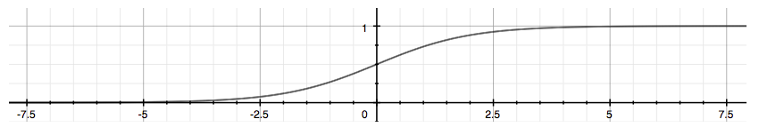

# 03 Week - Classification

Table of content:
- [03 Week - Classification](#03-week---classification)
  - [Introduction](#introduction)
  - [Hypothesis Representation](#hypothesis-representation)
  - [Decision Boundary](#decision-boundary)

----------------------------

## Introduction

Classification - to attempt classfication, one method is to use linear regression and map all predictions greater that 0.5 as a 1 and less than 0.5 as 0. However, this method doesn't work well because classfification is not actually a linear function.

Th classification problem is just like the regression problem, except that the values we now want to predict to taken on only a small number of discrete values. For now, we will focus on the binary classification problem in which `y` can take only two values, 0 and 1. (Most of what we say here will also generaliz to multiple class case).  For instance, if we are trying to build a spam classifier for email then `x`(i) may be some feature of piece of email and `y` may be 1 if its a piece of spam email, and 0 otherwise.

Hence, `y∈{0,1}` 0 is also called the negative class, and 1 the positive class, and they are sometimes also denoted by the sombiles `-` and `+`. Given `x`(i) is also called the label for the training example.

NOTE: The symbol `∈` indicates set membership and means “is an element of” so that the statement x∈A means that x is an element of the set A. In other words, x is one of the objects in the collection of (possibly many) objects in the set A.

--------------------

## Hypothesis Representation

We could approach the classification problem ignoring the fact that y is discrete-valued, and use our old linear regression alhorithm to try predict y give x. 

However, it is easy to construct example where this method performs very pooly. Intuitively, it also doens't make sense for h$\theta$ (x) to take values larger than 1 or smaller than 0 when we know that  `y∈{0,1}`  

To fix this, let's change the form for our hypothesis h$\theta$ 0 <= 1. This is accomplished by plugging $\theta$Tx into logistic function.

Our new form uses the `Sigmoid function` also called the `Logisitic function`.

hθ(x) = g(θTx)

z = θTx

g(z) = 1/(1+exponent−z)

The following image shows us what the sigmoid function looks like:

h$\theta$(x) will give us the **probability** that our output is 1. For examples h$\theta$(x) = 0.7 give us a probability of 7-% that our output is 1. Our probability that our predictions is 0 is just the complement of our probability that it is 1 (e.g If probability that it is 1 is 70%, then the probability that it is 0 is 30%)

formula **probability**

hθ(x) = P(y = 1 | x;$\theta$) = 1 - P(y=0| x; $\theta$)

P(y = 0|x;\$theta$) + P(y = 1 | x; $\theta$)

---------------

## Decision Boundary