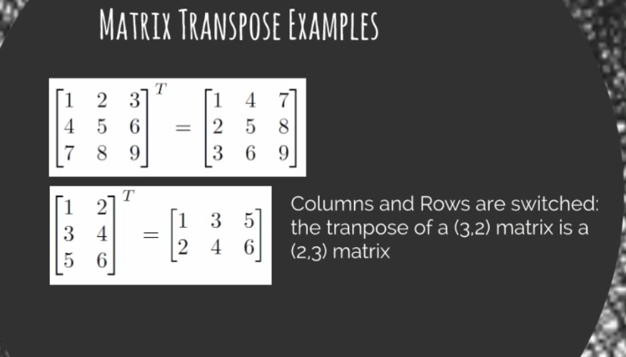
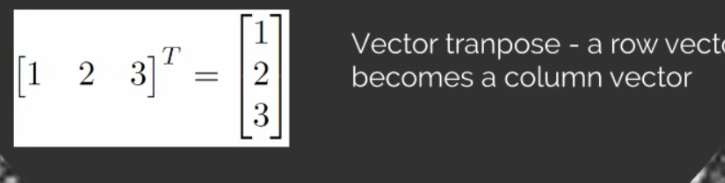

# Definition

- Scalar: single value e.g 6
- Vector: 1 dimensions array value e.g [1,2,3,4]
- Metrics: 2 dimensions array value e.g
- Tensor: tensor is multidimensional array
```
[
  [X0,0 X0,1 X0,2 X0,3 .... X0,n]    ^
  [X1,0 X1,1 X1,2 X1,3 .... X1,n]    | Rows
  [Xm,0, Xm,1, Xm,2,,.... Xm, n]     
  -----> Columns
]
```

## Matrix Transpose

- the transpose metrics is an operation which flips a matrics over its main diagonal (pindahkan atas kiri ke botom kirim)
- index dari row dan columns juga berubah






# Python

pada python kita menggunakan library `numpy` untuk manipulasi data dalam matrics, vector dan tensor

### vector
```
x = np.array((1,2,3)) 
```
value x akan bernilai x = [1,2,3]

### matrix
```
x = np.matrix([1,2,3],[4,5,6])
```
value `x` akan bernilai dua dimensi array = [[1,2,3],[4,5,6]]

### tensor (multi dimensional array)
```
x = np.ones((2,2N,3)) 
// the third number represent column 
// the second number represent  row
// the first number represent the dimension
```
value x akan membuat array dalam dua dimensi dengan value `1`
menjadi = 
```
[
  [
    [1,1,1],[1,1,1]
  ],
  [
    [1,1,1],[1,1,1]
  ]
]
```
