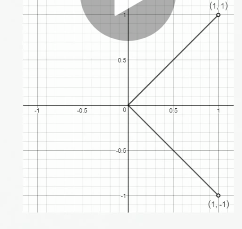

# Special Vector n Matrix


## Diagonal Matrices

A matrix is diagnonal if the following condition is statisfied:

D(i,j) = 0 for all i != j

an example diagonal matrix:
```
[
  [1,0,0],
  [0,2,0],
  [0,0,3]
]
```

1. diagonal matrix usefull because multiple by a diagonal matrix is computationally effecient
2. diagonal matrices do need to be square

```
For `diag(v)x`, we only need to scale each element x(i) by v(i)
```
example:

```
[[1,0,0],
  [0,2,0],
  [0,0,3]]
  
  X
  
[[1,1,1],
  [1,1,1],
  [1,1,1]]
  
= 

[[1,1,1],
  [2,2,2],
  [3,3,3]]
  ```

## Summetric Matrices

A symmetric matrix is any matrix that is equal to its transpose `A = A(t)`

an example symmetrix matrix
```
[
  [1,2,3]
  [2,3,4]
  [3,4,5]
]
```
note: - the transpose metrics is an operation which flips a matrics over its main diagonal (pindahkan atas kiri ke botom kirim)

python:
```python
x = np.matrix([[1,2,3],[2,3,4], [3,4,5]])
x.T #transpose the matrix
```
output:
```shell
matrix([[1, 2, 3],
        [2, 3, 4],
        [3, 4, 5]])
```


## The unit vector
A unit vector is a vector with unit norm
`||x||2 = unit vector`

A unit vector can be obtained by **normalizing vector**.

How to normalizing vector?

Normalization is the process of dividing a vector by its magnitude, which procuces a unit vector:

```shell
x = [1, 1, 1, 1]
x / root(4)
x = [1/2, 1/2, 1/2, 1/2]
```

## Orthogonality 

A vector `x` and a vector `y` are **orthogonality** to each other if `x T t = 0`

Intuitively, if two vectors are orthogonal and both vectors have a nonzero magintude, the will by at a 90 degree angle to each other

if two vector orthogonal and unit vectors, they are called orthonormal.

