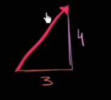

# Unit Vector

source: [Worked example: finding unit vector with given direction (video) \| Khan Academy](https://www.khanacademy.org/math/algebra-home/alg-vectors/alg-unit-vectors/v/unit-vector-intro?utm_account=Grant&utm_campaignname=Grant_Math_Dynamic&gclid=CjwKCAjw8pH3BRAXEiwA1pvMsTTa_WfrtAadAxKnX_ivQI-AaCIVRTfgv_KYATVfN3xg6V0xkkgZSBoCW24QAvD_BwE)

--------------

`Unit Vector = Magnitude of 1` ( unit vector hanyalah sebuah vector yang bergerak dalam arah tertentu yang memiliki besaran nilai 1)

defintion:
|a| adalah vector
|u| adalah unit vector

kita bayangkan kita memliki unit vector 

|a| = (3,4) 

vector |a| digambarkan seperti ini

apa itu magnitude? magnitude adalah panjang dari magnitude |a| dan kita bisa menggunakan Pythagorean theorem to figure this out.

kita dapat mengetahui panjang vector |a| dengan rumus ||a|| = $\sqrt{3^2 + 4^2}$ =  $\sqrt{25}$ = 5, jadi vector |a| adalah = 5

untuk mencari unit vector = 

`|u| = (3/|a| , 4/|a|) = (3/5, 4/5)`

sekarang kita perlu menghitung magnitude unit vector ||u||

||u|| = $\sqrt{9/25 + 16/25}$ = $\sqrt{25/25}$ = 1 (ini adalah unit vector)

9 dan 16, kita dapat dari rumus root $\sqrt{3^2 + 4^2}$