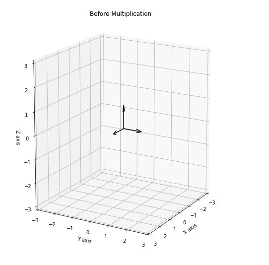

# Eigedecomposition

[Link to project](http://localhost:8888/lab/tree/eigendecompose_full.ipynb) - [Udemy Video](https://www.udemy.com/course/mathematical-foundation-for-machine-learning-and-ai/learn/lecture/10496544?start=345#notes)

Eigenvalues and eigenvector are easy to find with Python and numpy. remember, an eigenvector of square matrix $\textbf{A}$ is a nonzero vector $\textbf{v}$ such that multiplication by $\textbf{A}$ alter only the scale of $\textbf{v}$ 

$$\textbf{Av} = \lambda\text{v}$$ 


the scalar $\lambda$ is known as the eigenvalue corresponding to this eigenvector.


lets try with JupterLab

```python
# Find the eigenvalues and eigenvector for simple square matrix

A = np.diag(np.arange(1,4))
```

output:
```ssh
array([[1, 0, 0],
       [0, 2, 0],
       [0, 0, 3]])
```

pertama kita akan membuat diagonal matrix yang simple. lalu mencari eigenvalues dan eigen vector menggunakan lib `numpy`
```python

eigenvalues, eigenvectors = np.linalg.eig(A)

# returns the eigenvalues for the matrix

print eigenvalues
print eigenvector
```

output eigenvalues
```ssh
array([1., 2., 3.])
```

output eigenvector
```
array([[1., 0., 0.],
       [0., 1., 0.],
       [0., 0., 1.]])
```
eigenvector menyimpan posisi dimana value nonzero


We can easily double check that these are correct eigenvalues and eigenvectors, by plugging the back into eigendecomposition equation
the eigendecomposition of $\textbf{A}$ is given by 

$$\textbf{A} = \textbf{V}diag(\lambda)\textbf{V}^{-1}$$

Where $\lambda$ is equal to a vector of the eigenvalues, and $\textbf{V}$ is a matrix with one eigenvector per column.


you can try this in pyton

```python

# verify eigendecomposition

matrix = np.matmul(np.diag(eigenvalues), np.linalg.inv(eigenvectors))
output = np.matmul(eigenvectors, matrix).astype(np.int)

print output


[[1 0 0]
 [0 2 0]
 [0 0 3]]
```


------------

## Show Eigenvector as plot

```python

# import necessary matplotlib libraries
import numpy as np
import matplotlib.pyplot as plt
from mpl_toolkits.mplot3d import Axes3D
%matplotlib inline

# Declare diagonal matrix A
A = np.diag(np.arange(1,4))
eigenvalues, eigenvectors = np.linalg.eig(A)

# plot the eigenvectors

origin = [0,0,0]
fig = plt.figure(figsize=(18,10))

// set Ax1 as sub plot
ax1 = fig.add_subplot(121, projection='3d')

ax1.quiver(origin, origin, origin, eigenvectors[0, :], eigenvectors[1, :], eigenvectors[2, :], color= 'k')

# x limit 
ax1.set_xlim([-3,3])

# y limit
ax1.set_ylim([-3,3])

# z limit
ax1.set_zlim([-3,3])

# x,y &z label
ax1.set_xlabel('X axis')
ax1.set_ylabel('Y axis')
ax1.set_zlabel('Z axis')
ax1.view_init(15, 30)
ax1. set_title("Before Multiplication")

# show the plot
plt.show()
```

