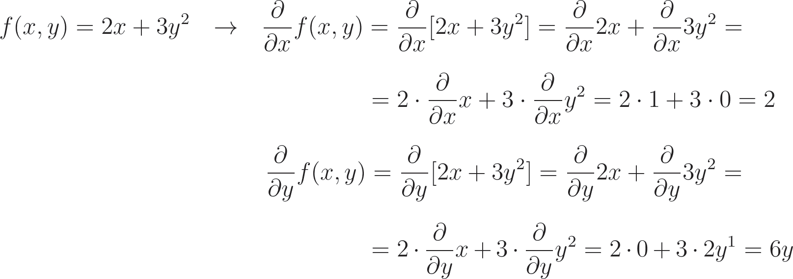
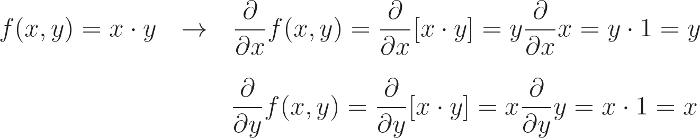
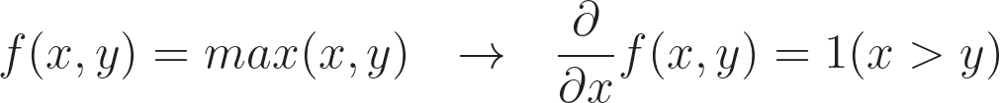
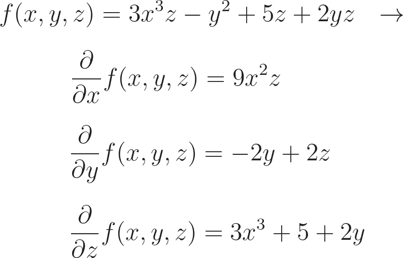
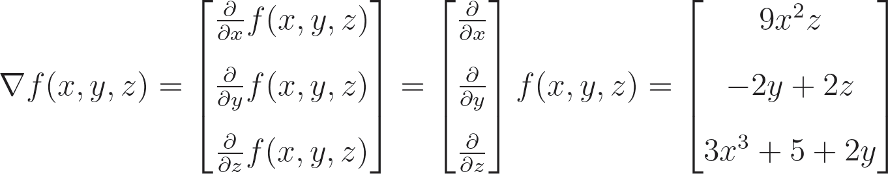
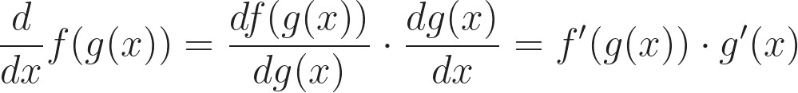

# The Partial Derivative

The **partial derivative** measures how much impact single input has on a function's output. The method for calculating a partial derivative is the same as for derivatives explained in the previous chapter; we simply have to repeat this process for each of the indepnendent inputs.

-----------------------------------

Jika yang di cari adalah nilai `x` makan value dari `y` akan selalu 0

# The Partial Derivative of Multiplication

Before we move on, let's introduce the partial derivative of multiplication operation:

In partial derivative multiplication we treat other independent variables as constants, and we also have learned that we can move constant to the outside of the derivative. 

It turn out that when we derive with respect to `x`, `y` is treated as a constant, and the result equals `y` multiplied by the derivative of `x` with respect to `x`, which is 1. The whole derivative then results with `y`. The intuition behind this is when calculating the partial derivative with respect to `x`, very change of `x` by 1 changes the function's output by `y`.

For example if `y=3` and `x=1`, the result is `1*3=3` When we change `x` by 1 so `y=3` and `x=2`, the result is `2*3=6`. We changed `x` by 1 and the result changed by 3, by the `y`. That's what partial derivative of this function with respect to `x` tells us.

Let's introduce a third input variable and add multiplication of variables for another example.

# The Partial Derivative of Max

The max function return the greatest input (obvious). We can denote that as `1(x > y)`, which mean 1 if the condition is met, and 0 otherwise.

# The Gradient

As we mentioned ata the beginning of this chapter, the gradient is a **vector** composed of all of the partial derivatives of a function, calculated with respect to each input variable.

Let's return to one of the partial derivatives of the sum operation that we calculated earlier:

<small>"partial derivative of the sum operation"</small>

If we calculate all of the partial derivatives, we can form a gradient of the function. Using different notations, it look as follows:

# The Chain Rule

If you read again code we wrote everything work like chain from Dense Layer to Activation to Lost function and input data, weights and biases, and to improve loss, we need to learn how each weight and bias impact it.

The chain rule say that the derivative of a function chain is a production of derivatives of all of the functions of this chain, for example:

