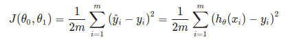

# Model and Const Function

Table of contents:

- [Model and Const Function](#model-and-const-function)
  - [Model Representation](#model-representation)
    - [How do we represent h?](#how-do-we-represent-h)
  - [Cost Function](#cost-function)
  - [Cost Function - Intuition I](#cost-function---intuition-i)
  - [Cost  Function - Intuiton II](#cost-function---intuiton-ii)
  - [Gradient Descent Algorithm](#gradient-descent-algorithm)

## Model Representation

Notation we use in entire course:
- m = Number of traning examples
- x's = "input" variable/features
- y's = "output" variable / "target" variable
- (x, y) = one training examplem and the dataset that we'll be using to learn
- (x[i], y[i]);i = 1...m - its called training set - i __th__ training example, [i] defined the index input or output data
- h = hypothesis is a maps from x's to y's , it take input and create output for estimated value

### How do we represent h?

h(x) -> y 

Linear regression with one variable. (x) Univariate(one variable) linear regression.

When the target variable that we're trying to predict is countinoues, such as in our house example, we call the learning proble a regression probile. 

When y can take on only a small number of discrete values (such as if, given the living area, we wanted to predict if a dweling is a house or a apartment, say), we call it  a classification problem.

-----------

## Cost Function

[doc](https://www.coursera.org/learn/machine-learning/supplement/nhzyF/cost-function)

Const function will let us figure out how to fit the best possible straight line to our data.

We can measure the accuracy of our hypothesis function by using a **cost function**. 
This takes an averag difference(actually a fancier version of an average) of all the results of the hypothesis with input from x's and the  actual outpus y's.

To break it apart, it is `1/2x` where `x` is the mean of squares of `h(theta) (x[i]) - y[i], or the difference the predicted value and the actual value.

This function is otherwise called the "Squared error function", or "Mean squared error". The mean is haved (1/2) as a convenience for computation of the gradient descent, as the derivative term of the square function will cancel out the `1/2` term. Th following image summarize what the const function does.

---------------------

## Cost Function - Intuition I

[doc](https://www.coursera.org/learn/machine-learning/supplement/u3qF5/cost-function-intuition-i)

If we try to think of it in visual terms, our training data set is scattered on the x-y plane. We are trying to make a straight line (defined by `h(thetha)(x)`) which passes through these scattered data points.

Our objective is to get the best posible line. the best posible line will be such so that the average squared vertical distances of the scattered points from the line will the least. ideally, the line should pass through all the points of our training data set. In such a case, the value of `J(0[0], 0[1])` will be 0, The following example shows the ideal situation where we hae a cost function of 0.

When `0[1]=1`, we get a slope of which goes through every single data point in our model. Conversely, when `0[1] = 0.5`, we see the vertial distance from our fit to the data points increase.

Th increases our cost function to 0.58. Plotting several other points yeilds to the following graph:

Thus as a goal, we should try to minimize the cost function. In this case `0[1] = 1` is our global minimum

-------

## Cost  Function - Intuiton II

[video](https://www.coursera.org/learn/machine-learning/lecture/nwpe2/cost-function-intuition-ii)
[doc](https://www.coursera.org/learn/machine-learning/supplement/9SEeJ/cost-function-intuition-ii)

NOTE: read about contour figure,  i still not fully understand this part :/

--------

## Gradient Descent Algorithm

Gradient descent its used for minimizing some arbitary function J (const function) and other function in next course.

Problem Setup

Have some function J($\theta$[0], $\theta$[1])
Want min J($\theta$[0], $\theta$[1])

__Outline__ :
- Start with some $\theta$0, $\thehta$
- Keep changing $\theta$[0] $\theta$[1] to reduce J($\thetha$[0], $\thetha$[1]) until we hopefully end up at a minimum

 
