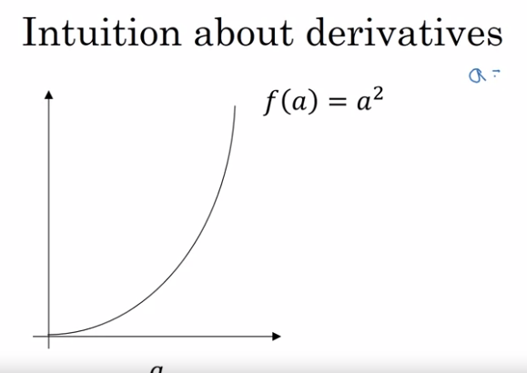
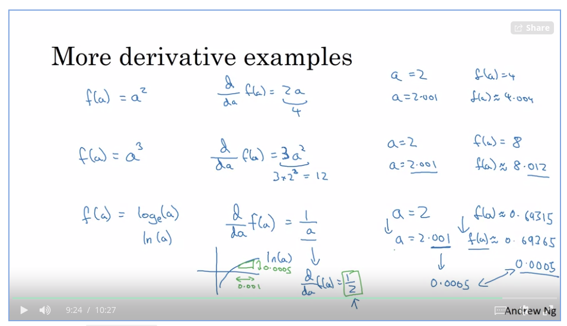

[Video](https://coursera.org/share/629a901b838be6893291769188e6ad30)

Different between the cost function and the loss function for logistic regression?

1. The loss function computes the error for a single training sample
2. The cost function is the average of the loss function of the entire training set.

# Derivatives

The derivative (formula/function) can be different at different points on the curve. 

## The straight line/ f(a)

If we have straight line with function `f(a)`, let put some example below.


```python

# f(a) = 3

a = 2 
f(a) 

# output
6

# and if we add another value to increase the line little bit
a = 2.001
f(a)

# output
6.001
```

So we can say the slope is three (3). The term derivative basically means slope.

We can write the slope function f(a), like this

`df(a)/da = 3`


But all this equation means is that, if I nudge `a` to the right a little bit, I expect `f(a)` to go up by three times as much as I nudged the value of little `a`

So, this function has a safe slope everywhere. One way to see that is that, wherever you draw this little triangle. The height, divided by the width, always has a ratio of three to one. 

On a straight line, the function's derivative doens't change.

-----------------------

## The curve line




1. f(a) = a<sup>2</sup>

```python

a = 2 
f(a)
# output
4

# let nudge litle to the right
a = 2.001
f(a)
# ouput
4.004001

```

The diff between a(2) = 4 and a(2.001) = 4.004 is a 4, so we can say it, slope (derivative) of  f(a) = a<sup>2</sup> is 4.

but if we change value a = 5 then.

```python
a = 5
f(a)
# output
25

# let nudge litle to the right
a = 5.001
f(a)
# ouput
25.010
```

so the slope/ derivative is 10 when a = 5.

-----------------------------

Below, i put image for more derivative example and their formula in calculus



## Takeaways Key

# What you need to remember:
1. np.exp(x) works for any np.array x and applies the exponential function to every coordinate
2. the sigmoid function and its gradient (view excercise)
3. image2vector is commonly used in deep learning
4. np.reshape is widely used. In the future, you'll see that keeping your matrix/vector dimensions straight will go toward eliminating a lot of bugs.
5. numpy has efficient built-in functions
6. broadcasting is extremely useful
