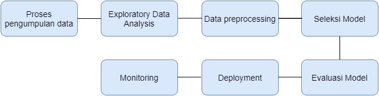
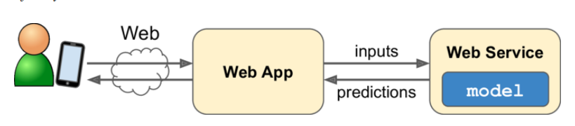

# Machine Learning Workflow

Tahapan dalam diagram ini bersifat iteratif yang berarti prosesnya bisa berulang sesuai kebutuhan. Anda mungkin perlu untuk mengevaluasi ulang proses yang Anda jalankan dan kembali ke langkah sebelumnya, kapan saja dibutuhkan selama prosesnya.

1. Pengumpulan data
2. Exploratory Data Analysis: 
   
   Pada bagian ini anda mencari pola, anomali, menguji hipotesis, memahami distribusi, frekuensi, hubungan antar variable dan memeriksa asumsi dengan teknik statistik dan representasi grafik.
3. Data Preprocessing
   Pada bagian ini kita mentraformasi fitur-fitur dalam ke dalam bentuk yg mudah diinterpretasikan dan diproses oleh algoritma machine learning seperti proses data cleaning penanganan missing value, data yang tidak konsisten, duplikasi data, ketidakseimbangan data, dll. Sementara beberapa hal yang bisa dilakukan untuk proses transformasi data adalah: scaling atau merubah skala data agar sesuai dengan skala tertentu, standarisasi, normalisasi, mengonversi data menjadi variabel kategori, dan sebagainya. Tidak lupa pula, proses train-test split yang pernah kita pelajari pada modul sebelumnya juga merupakan bagian dari data preprocessing. 
4. Model Selection
   Jie Ding, et al dalam tulisannya “Model Selection Techniques -An Overview” menyatakan bahwa tidak ada model yang cocok secara universal untuk data dan tujuan apa pun
5. Model Evaluation
   Langkah ini mengevaluasi model akhir pada data uji. Sederhananya, langkah evaulasi model dapat dijabarkan sebagai berikut: memprediksi label pada data uji, menghitung jumlah prediksi yang salah (eror) kemudian membandingkannya dengan data label yang kita miliki. Dari data perbandingan ini kita dapat menghitung akurasi atau performa model.
6. Deployment 
   Ketika model dievaluasi, model siap untuk dipakai pada tahap produksi. Caranya adalah dengan menyimpan model yang telah dilatih dari tahap preprocessing hingga pipeline prediksi. Kemudian deploy model tersebut ke tahap produksi untuk membuat prediksi dengan memanggil kode predict()-nya.

   

7. Monitoring
   Model yang telah dipakai dalam tahap produksi masih harus tetap dimonitor untuk menjaga kualitasnya. Pada tahap produksi model bisa saja menemukan data yang tidak dikenali sehingga performa model dapat menurun. Contoh kasus sistem rekomendasi kita dapat memantau performa model dengan cara menghitung jumlah produk rekomendasi yang terjual setiap hari.

   Jika Anda bekerja dengan model machine learning yang datanya terus berubah, Anda perlu melakukan update pada dataset dan melatih ulang model Anda secara reguler. Atau, Anda perlu membuat sistem yang dapat membuat proses update ini berjalan secara otomatis. 

