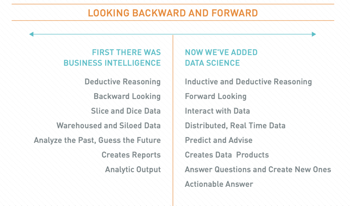

# ML dan Business Intelligence

Berikut adalah perbedaan antara BI dan ML yang dirangkum oleh Booz Allen Hamilton.

# ML di bidang Data Analytic

Data analytics memungkinkan kita untuk menjelaskan apa yang terjadi di masa lalu, mendapatkan informasi penting tentang masa kini, dan membuat prediksi tentang masa depan.
