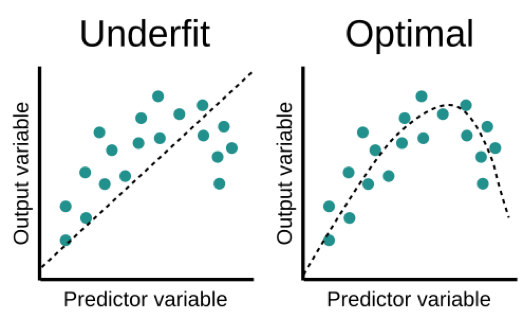
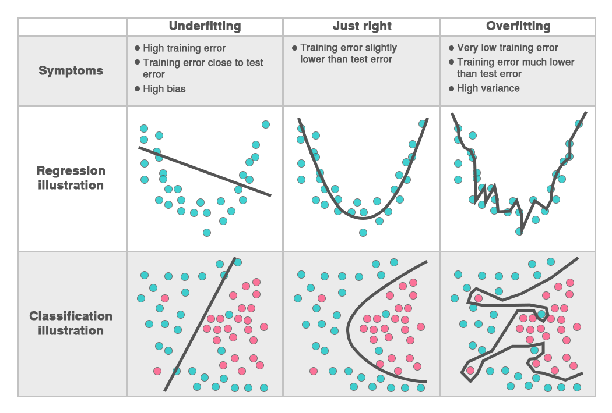

# Overfitting dan Uderfitting

Sebuah model ML yang layak untuk di-deploy di tahap produksi adalah model yang tidak underfit atau overfit. Sebuah model yang tidak overfit dan underfit juga disebut dengan model good fit.

Bagaimana untuk melihat apakah sebuah model overfit atau underfit?

Salah satu caranya telah kita pelajari sebelumnya, yakni dengan membagi dataset menjadi train set dan test set.

## Overfitting

Bayangkan suatu saat Anda berkunjung ke suatu kota, kemudian Anda mengalami kejadian tidak menyenangkan seperti dicopet di dalam angkutan umum. Anda kemudian mungkin akan berpikir bahwa semua angkutan umum di kota tersebut tidak aman. Kadang-kadang, kita melakukan generalisasi yang berlebihan terhadap sesuatu.

Demikian halnya pada mesin yang juga bisa terjebak pada persepsi generalisasi yang sama. Dalam machine learning, kondisi ini disebut sebagai overfitting.

Pada model klasifikasi jika akurasi model pada data training tinggi dan data testing rendah, maka model yang Anda kembangkan overfitting. Pada model jenis regresi, jika model membuat kesalahan yang tinggi pada data testing maka model tersebut overfitting.

Beberapa cara untuk menghindari overfitting yaitu:

1. Memilih model yang lebih sederhana, contohnya pada data yang memiliki pola linier menggunakan model regresi linear daripada model decision tree.
2. Mengurangi dimensi data contohnya dengan metode PCA yang telah Anda pelajari.
3. Menambahkan data untuk pelatihan model jika memungkinkan.

## Underfitting

Underfit terjadi ketika model terlalu sederhana dan tidak mampu untuk menyesuaikan pola yang terdapat pada data latih. 

Sebuah model dapat dikatakan underfit jika memiliki eror yang tinggi pada data training. Underfitting menandakan bahwa model tersebut belum cukup baik dalam mengenali pola yang terdapat pada data latih. Misalnya ketika sebuah model dilatih pada data latih yang memiliki 50 sampel coklat dan 50 sampel kacang. Setelah pembelajaran dengan data latih, model malah mengenali pada data latih terdapat 90 sampel coklat dan 10 sampel kacang.

Pada kasus klasifikasi, underfitting ditandai ketika model memiliki akurasi yang rendah pada data training. Pada kasus regresi, underfitting terjadi ketika model memiliki tingkat eror yang tinggi.

Cara menghindari underfitting adalah dengan menyeleksi model atau meningkatkan performa dengan tuning hyperparameter. Kualitas data juga sangat mempengaruhi dataset. Model machine learning yang sangat kompleks sekalipun tidak akan memiliki performa yang baik jika data yang digunakan memiliki kualitas yang buruk. 

Ingat prinsip: “Garbage in, garbage out” ya.

## Good Fit

Model ML yang baik adalah model good fit atau model yang tidak underfit maupun overfit. Sebuah model good fit akan memprediksi lebih baik dan membuat lebih sedikit kesalahan di tahap produksi. Contoh dari model yang tidak good fit seperti di bawah.

Berikut sebuah tabel yang membandingkan model yang underfitting, good fit, dan overfitting pada masalah regresi dan klasifikasi.

