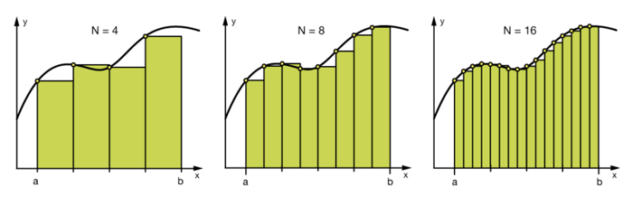
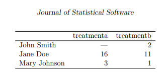
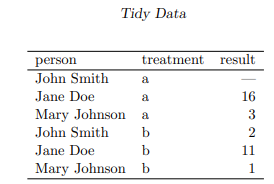

# Menambahkan/Mengurangi Fitur


Berdasarkan pernyataan dari Andrewa tahap rekayasa fitur merupakan salah satu tahapan yang memakan banyak waktu. Jadi, rekayasa fitur itu pastinya penting ya.

Nah, di submodul ini Anda akan dikenalkan dengan beberapa teknik lain dalam rekayasa fitur yang sudah dibahas pada modul sebelumnya.

## Binning

Binning adalah pengelompokan nilai sesuai dengan batas besaran yang ditentukan. Pada binning, data dikelompokkan dalam tiap ‘bin’ sesuai dengan nilai yang cocok dengan bin tersebut. Bin sederhananya adalah sebuah kategori yang menampung nilai-nilai tertentu.

Binning jarak nilai-nilai sebuah atribut dikategorikan ke dalam jumlah bin tertentu yg memiliki interval sama besar.

Pada gambar dibawah dapat dilihat contoh kumpulan nilai yang dibagi menjadi 4 bin, 8 bin, dan 16 bin.





Binning bisa membantu untuk menghindari overfitting dan terkadang me-improve akurasi dari predictive model. Namun binning juga mengorbankan informasi yang terkandung dari sebuah atribut sehingga, penggunaanya perlu dilakukan dengan teliti.

Contoh binning pada *dataframe pandas*

```python

data[‘bin’] = pd.cut(data[‘value’], 
    bins=[0, 30,  70, 100], 
    labels=[“Low”, “Mid”, “High”])
 
 
    value    bin
0      13    Low
1      25    Low
2      32    Mid
3      94    High
4      49    Mid
```

Learn more about binning:
1. Coursera: ([IBM Data Analytic with Python](https://www.coursera.org/lecture/data-analysis-with-python/binning-in-python-T8z3M))
2. [Google Machine Learning Crash Course](https://developers.google.com/machine-learning/crash-course/representation/cleaning-data)

-------------------------------

## Splitting

Pada [Handle Wickham](https://www.jstatsoft.org/article/view/v059i10) dia menjelaskan data yg rapih lebih mudah untuk di manipulasi, model dan visualisasi.

Menurut Wickham Tidy data harus memenuhi kriteria berikut.
1. Each variable form a column.
2. Each observaction forms a row
3. Each type of obvervational unit forms a table.

Messy Data



Tidy Data




Memisahkan sebagian data dalam kolom menjadi fitur baru memberikan keuntungan antara lain: 
1. meningkatkan performa model dengan menemukan informasi berharga; 
2. membuat kita lebih mudah untuk melakukan proses binning (yang akan dijelaskan kemudian) dan grouping.

```python

import pandas as pd 
 
Developer = pd.DataFrame({'Name': ['Isyana Saraswati', 'Nicholas Saputra', 'Raisa Andriana'], 
        'Age':[30, 36, 32]}) 
print("Machine Learning Developer di Indonesia :\n", Developer) 
 
Developer[['First','Last']] = Developer.Name.str.split(expand=True) 
print("\n Split kolom 'Name', lalu tambahkan kedua kolom : \n", Developer)

```

## Interation feature

Dalam model Machine Learning, kita dapat menciptakan fitur/atribut baru dari fitur2 yg ada. Mengkombinasikan dua atribut kadang bisa menjelaskan varian data dengan lebih baik dibanding dua atribut yang dioperasikan secara terpisah.

Membuat atribut baru melalui interaksi antar atribut disebut sebagai interaction feature. Sederhananya, interaction feature adalah perkalian produk antara dua buah fitur.

Mari kita jabarkan penjelasan di atas dalam contoh berikut.

1. Misal kita telah memiliki sebuah atribut bernama ‘schools’ yaitu sejumlah sekolah yang berada dalam radius 5 km dari pusat kota.

2. Kita juga memiliki atribut lain yaitu ‘accredited_A’ yang merupakan sejumlah sekolah yang telah terakreditasi A.

3. Dalam menentukan pilihan sekolah, kita mungkin menginginkan sekolah yang dekat tapi juga telah memiliki akreditasi A. 

4. Untuk mengakomodasi kebutuhan tersebut, kita dapat membuat atribut baru misalnya: ‘selected_schools’ = ‘schools’ x ‘accredited_A’

Mudah bukan? Betul, interaction feature sangat mudah untuk dirumuskan, tetapi biaya komputasinya cukup tinggi. Untuk sebuah model linear dengan interaction feature berpasangan, kebutuhan waktu pelatihannya akan berubah dari O(n) menjadi O(n2), di mana n adalah jumlah fitur tunggal. 

Ada beberapa cara untuk mengatasi permasalahan ini. Pertama adalah dengan melakukan feature selection, teknik lain dalam feature engineering. Cara kedua adalah dengan menyusun (handcrafted) sejumlah kecil fitur kompleks secara hati-hati.
