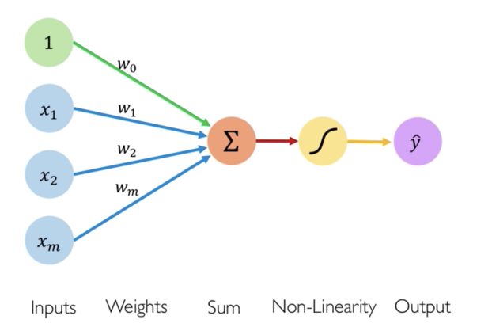

# Artificail Neural Network

Artificial neural networks terinpirasi dari otak manusia yang ditranslate ke dalam komputer. Ini bukan perbandingan yg 100% sesuai tetapi nurons, activations, dan banyak interkoneksi, meskipun prosess di dalamnya sedikit berbeda.

Single neuron (**Preceptron**) tidak terlalu berguna, tetapi jika digambungkan menjadi ribuan atau ratusan nuron yang saling berhubungan seringkali menghasilkan output yg tidak bisa dibadingkan dengan method machine learning lainnya [NNFS - Bab 1]

<small>NOTE: Perceptron is a single layer neural network and a multi-layer perceptron is called Neural Networks.</small>

Formula Preceptron

`Y = Activation function(∑ (weights*input + bias)) `

Ann memiliki 5 komponen yaitu:

1. Input (xi)

2. Bobot atau weights (Wi) dan bias (W0)

3. Penjumlahan atau sum (∑)

4. Activation function atau non linearity function (⎰)

5. Output (y)

## Activation function

Activation function memutuskan apakah nueron tidak active atau active.

Activation function juga membantu untuk menormalisasi output dalam semua input dengan range antara 1 to -1

Ada 3 fungsi aktivasi yang paling umum yaitu 
1. Sigmoid function
2. Hyperbolic tangent
3. Rectified linear unit (ReLU)

### Sigmoid atau Logistic Function.

Fungsi ini berada di antara nilai 0 hingga 1 sehingga biasanya digunakan untuk memprediksi model probabilitas yang outputnya ada di kisaran 0 dan 1.

### Hyperbolic Tangent (tanh)

Sama seperti fungsi sigmoid, fungsi tanh berbentuk S, kontinu, dan dapat dibedakan. Perbedaannya adalah nilai keluarannya berkisar dari -1 hingga 1.

### Rectified Linear Unit (ReLU) 

Fungsi ReLU bersifat kontinu meski kemiringannya berubah secara tiba-tiba dan nilai turunannya bernilai 0 pada z < 0.

