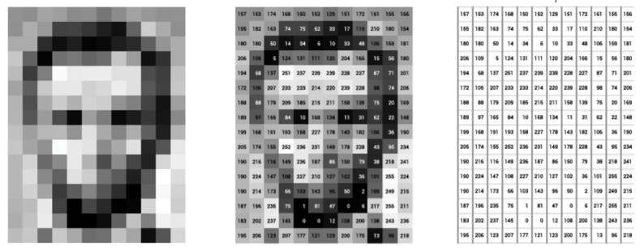
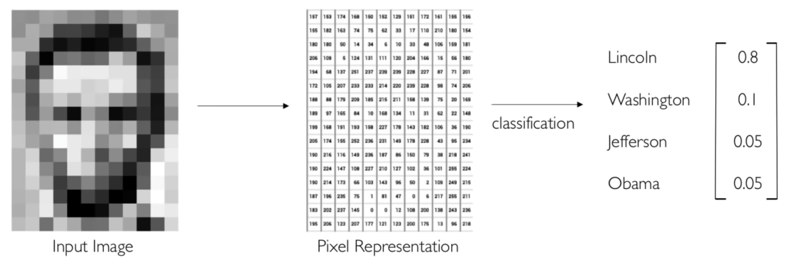
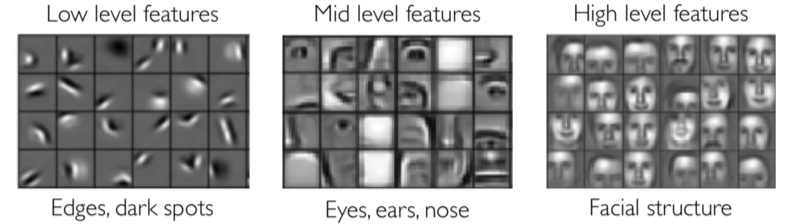
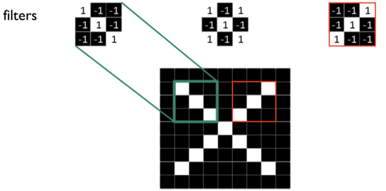
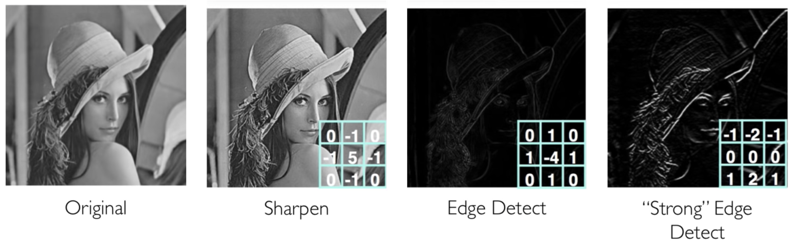
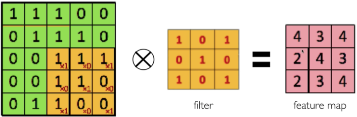
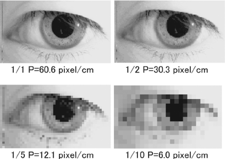
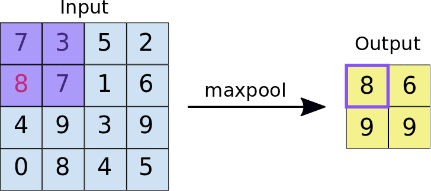
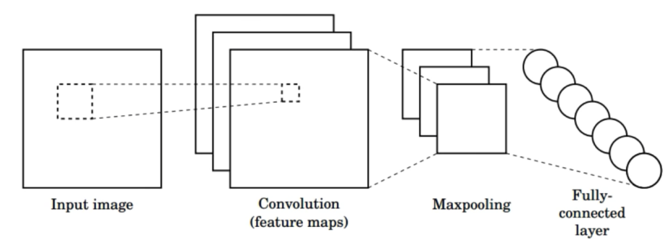
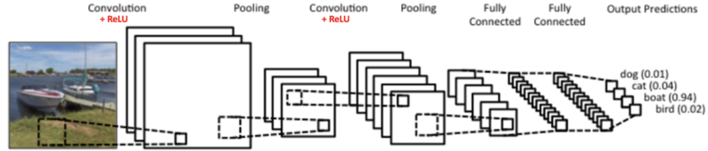

# Convolutional Neural Network

Convolutional neural networks (CNNs) pertama kali dikenalkan oleh Yann LeCun et all., pada tahun 1998 dalam makalahnya “Gradient-Based Learning Applied to Document Recognition” [22].

Sejak ditemukannya LeNet, para peneliti terus melakukan riset untuk mengembangkan model CNN. Hingga pada tahun 2012, Alex Krizhevsky memperkenalkan AlexNet [23], versi lebih canggih dari CNN yang memenangkan perlombaan terkenal ImageNet. AlexNet ini adalah cikal bakal deep learning, salah satu cabang AI yang menggunakan multi-layer neural networks.

## Bagaimana Komputer Melihat

Sebuah gambar dalam komputer adalah matriks yang berisi nilai dari setiap pixel di gambar. Pada gambar hitam putih, gambar merupakan matriks 2 dimensi. Pada gambar berwarna, gambar merupakan matriks 2 kali 3 dimensi di mana 3 dimensi terakhir adalah jumlah kanal dari gambar berwarna yaitu RGB (red, green, blue).

## Klasifikasi Gambar

Salah satu peran machine learning dalam computer vision adalah pada klasifikasi gambar. Contohnya, kita punya label yaitu nama beberapa presiden Amerika Serikat. Kita ingin memprediksi siapa presiden di gambar. Jaringan saraf seperti di bawah menunjukkan probabilitas siapa presiden di dalam foto.

## Convolutional Layer

Sebuah jaringan saraf biasa mengenali gambar berdasarkan piksel-piksel yang terdapat pada gambar. Teknik yang lebih optimal adalah dengan menggunakan convolutional layer di mana alih alih mengenali objek berdasarkan piksel-piksel, jaringan saraf dapat mengenali objek berdasarkan atribut-atribut yang memiliki lebih banyak informasi.

Convolutional layer berfungsi untuk mengenali atribut-atribut unik pada sebuah objek.  Atribut-atribut yang lebih rendah membentuk atribut lebih tinggi contohnya atribut **wajah** dibentuk dari atribut **mata, telinga, dan hidung**. Atribut mata dibentuk dari garis, lengkungan dan bintik hitam.

## Filter

Convolutional layer dapat mengenali atribut pada objek menggunakan filter. Filter hanyalah sebuah matriks yang berisi angka-angka. Pada gambar di bawah terdapat 3 buah filter masing-masing merupakan matriks 3x3 dan sebuah objek yaitu gambar berisi huruf X. Filter yang berada di sebelah kiri digambarkan dapat mengenali garis yang terdapat pada kotak hijau. Setiap filter berbeda dapat mengenali atribut yang berbeda seperti, filter di kanan dapat mengenali atribut objek x yang berada di kotak merah.

Contoh lain dari filter dapat Anda lihat di bawah. Pada sebuah gambar perempuan, aplikasi dari filter yang berbeda menghasilkan gambar yang berbeda.

Kita dapat membedakan seekor kuda dan manusia berdasarkan bentuknya bukan? Nah, dengan filter seperti pada gambar yang paling kanan, kita dapat mendeteksi garis-garis yang bisa menunjukkan apakah seseorang merupakan kuda atau manusia berdasarkan bentuk garisnya.

## Proses Konvolusi

Proses konvolusi adalah proses yang mengaplikasikan filter pada gambar. Pada proses konvolusi ada perkalian matriks terhadap filter dan area pada gambar.

Ketika proses konvolusi selesai, hasil dari konvolusi tersebut dapat dijadikan masukan untuk sebuah MLP.

## Max Pooling

Pooling adalah proses untuk mengurangi resolusi gambar dengan tetap mempertahankan informasi pada gambar. Contohnya seperti pada gambar berikut di mana ketika resolusi dikurangi sampai batas tertentu kita masih bisa mendapatkan informasi mengenai objek pada gambar.

Salah satu contoh dari pooling adalah max pooling. Pada max pooling di antara setiap area dengan luas piksel tertentu, akan diambil satu buah piksel dengan nilai tertinggi. Hasilnya akan menjadi gambar baru. Animasi di bawah menunjukkan contoh max pooling dengan ukuran 2x2 piksel pada gambar berukuran 4x4 piksel. Hasil dari max pooling adalah gambar dengan ukuran 2x2 piksel

Proses max pooling dipakai karena pada praktiknya, jumlah filter yang digunakan pada proses konvolusi berjumlah banyak. Ketika kita menggunakan 64 filter pada konvolusi maka akan menghasilkan 64 gambar baru. Max pooling membantu mengurangi ukuran dari setiap gambar dari proses konvolusi.

## Arsitektur Convolutional Neural Network

Arsitektur CNN adalah sebuah jaringan saraf yang menggunakan sebuah layar konvolusi dan max pooling. Pada arsitektur CNN di bawah, sebuah gambar masukan dideteksi atribut/fitur nya dengan menggunakan konvolusi 3 filter. Lalu setelah proses konvolusi akan dilakukan max pooling yang menghasilkan 3 buah gambar hasil konvolusi yang memiliki resolusi lebih kecil. Terakhir, hasil max pooling dapat dimasukkan ke dalam sebuah hidden layer MLP.

Kita juga dapat menggunakan beberapa lapis konvolusi dan max pooling sebelum mulai memasukkannya ke hidden layer sebuah MLP. Cara kerjanya sederhana. Kita bisa melakukan proses konvolusi dan max pooling setelah lapisan max pooling sebelumnya. Pada contoh di bawah terdapat 2 kali proses konvolusi dan max pooling sebelum hasilnya dimasukkan ke dalam hidden layer.

Dengan beberapa lapis proses konvolusi, makin detail fitur yang dapat dikenali dari gambar. Contohnya pada proses konvolusi pertama dapat mendeteksi wajah dari seorang manusia. Lalu pada proses konvolusi kedua, wajah hasil konvolusi pertama dapat dideteksi fitur yang lebih detail seperti hidung, mata, dan telinganya sehingga, model makin pintar membedakan wajah setiap orang. Jika Anda ingin mengetahui lebih detail mengenai CNN, Anda dapat mengunjungi [tautan](https://cs231n.github.io/convolutional-networks/) berikut yah.
