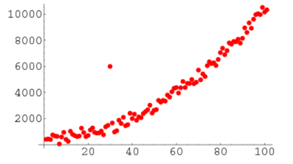

# Data Preparation

## One Hot Encoding

One Hot Encoding adalah teknik yg mengubah data ketegorik menjadi numeric dengan menambahkan column baru.

| gender | 
| -- |
| Perempuan |
| Laki2 |
| Perempuan |
| Laki2 |

Convert to

| Laki2 | Perempuan |
| -- | -- |
| 0 | 1 |
| 1 | 0 |
| 0 | 1 |
| 1 | 0 |

## Outlier Removal

Menghapus data yang bernilai jauh atau berbeda dari kumpulan nilai lainnya.

Contoh visualisasi terhadap data outlier




## Normalization

Tujuan dari Normalization adalah mengubah nilai-nilai dari sebuah fitur ke dalam skala yang sama.

Dengan data yg ter-normalisasi dapat meningkatkan performa dan stabilitas dari sebuah model machine learning.


| Nama | Gaji | Umur |
| -- | -- | -- |
| A | 12.000.000 | 33 |
| B | 35.000.000 | 45 |
| C | 4.000.000 | 23 |
| D | 6.500.000 | 26 |
| E | 9.000.000 | 29 |

Contoh dari normalization adalah ketika kita memiliki dataset seperti di atas yang memiliki fitur umur dengan skala 23 sampai 45 tahun dan fitur penghasilan dengan skala 4.000.000 sampai 35.000.000. Di sini kita melihat bahwa fitur penghasilan sekitar satu juta kali lebih besar dari fitur umur dan menunjukkan kedua fitur ini berada pada skala yang sangat jauh berbeda.

Ketika membangun model seperti regresi linear, fitur penghasilan akan sangat mempengaruhi prediksi dari model karena nilainya yang jauh lebih besar daripada umur, walaupun tidak berarti fitur tersebut jauh lebih penting dari fitur umur.

contoh code lihat exercise [normalization.py](exercise/2.normalization.py).

output from the code.

```python
[0.25806452 0.45454545]
 [1.         1.        ]
 [0.         0.        ]
 [0.08064516 0.13636364]
 [0.16129032 0.27272727]]
```

## Standardization 

Prosess ini adalah konversi suatu fitur hingga nilai-nilai tersebut memilki skala yang sama.

` z = (value - mean) / standard deviation`

dimana `mean` is the mean of the training samples or zero if with_mean=False, and standard deviation is the training samples .


contoh code lihat exercise [standardization.py](exercise/2.standardization.py)
