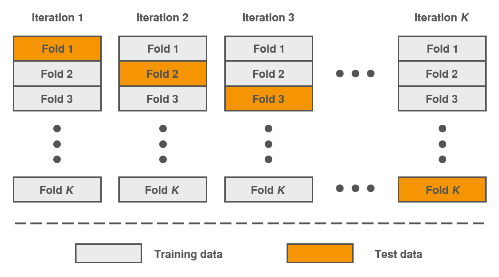

# Data Evaluation

Terkadang ketika kita hanya test model pada satu algoritma pada dataset yang sama menyebabkan model tersebut tidak bekerja dengan baik ketika menemui data baru.

## Train, Test, Validation Set

Validateion set adalah bagian dari train set yg dipakai untuk pengujian model pada tahap awal.

Tetapi jika ukuran validation set-nya terlalu kecil, maka ada kemungkinan kita memilih model yang tidak optimal. Sebaliknya, ketika ukurannya terlalu besar, maka sisa data pada train set lebih kecil dari data train set utuh. Kondisi ini tentu tidak ideal untuk membandingkan model yang berbeda pada data training yang lebih kecil. Solusi untuk masalah ini adalah dengan menggunakan Cross Validation.

## Cross Validation

K-Fold Cross Valiation dalam evaluasi model ML pada cross validation dataset dibagi sebanyak K lipatan. Dengan menggunakan cross validation kita akan memperoleh hasil evaluasi yang lebih akurat karena model dievaluasi dengan **seluruh data**. Berikut adalah ilustrasi dari K-cross validation. 

Secara umum jika hasil dari pengujian tiap fold pada cross validation memiliki nilai yang bervariasi dari 0.85 sampai 0.99, maka model tersebut dapat dikatakan baik.
