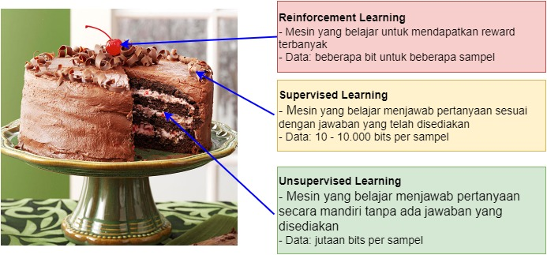
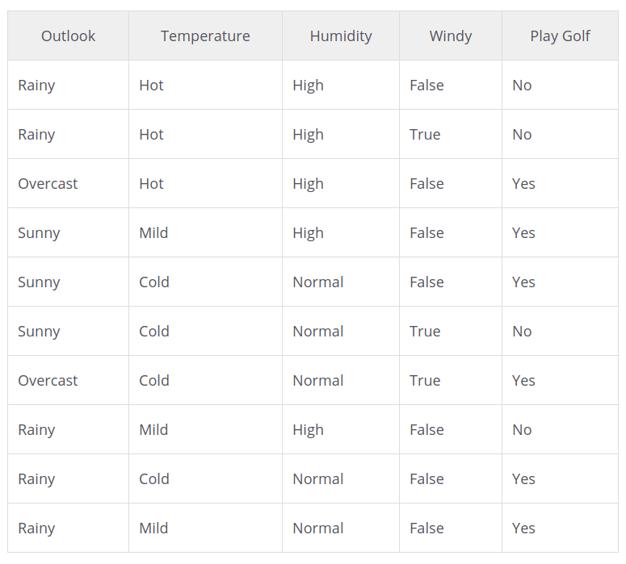
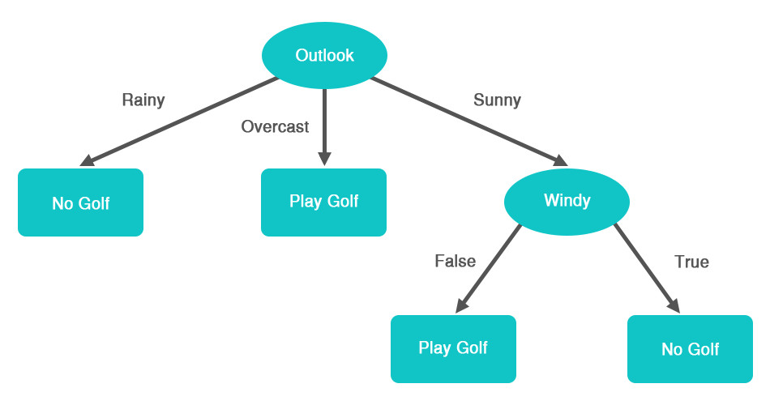
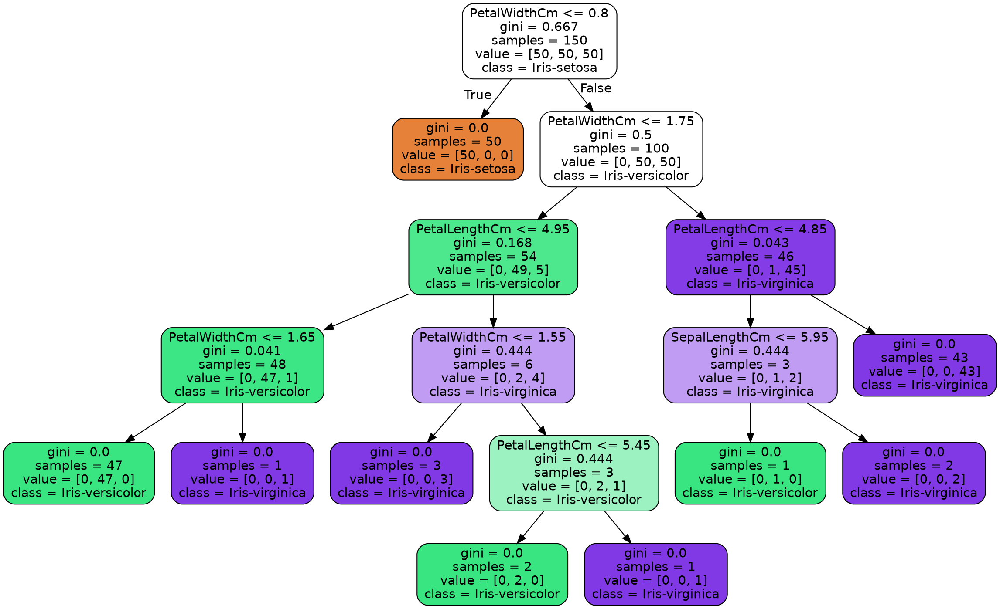
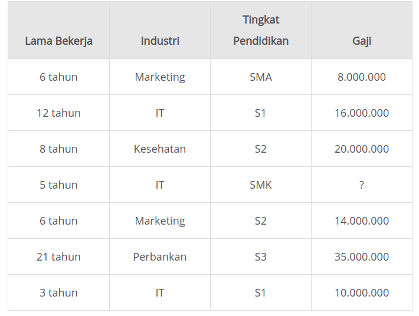
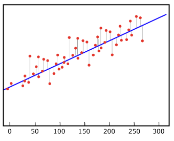
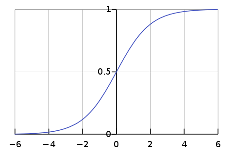

# Supervised dan Unsupervised Learning

“Jika sistem kecerdasan adalah sebuah kue, unsupervised learning akan menjadi kuenya, supervised learning adalah lapisan gula pada kue, dan reinforcement learning akan menjadi buah cherry pada kue”.

Algoritma yang termasuk supervised learning
- Klasifikasi -> menentukan apakah gambar dengan label hijau adalah semangka atau bukan
- Regresi ->  Alhoritma regresi kita memprediksi hasil dalam keluaran yang kontinyu berupa fungsi.
- Decision tree 
- Support vector machine. 

Unsupervised: 
- Clustering
- Pendeteksian anomali (anomaly detection)
- Pengurangan dimensi.

## Supervisied

### Binary Classification

Klasifikasi biner bertujuan untuk membedakan dua kelas yang berbeda, seperti apakah email ini spam atau tidak atau apakah image dibawah adalah semangka atau apel.

### Multiclass Classification

It's same with binary classificiation but with more label.

## Decision Tree

Decision tree memprediksi sebuah kelas (klasifikasi) atau nilai (regresi) berdasarkan aturan-aturan yang dibentuk setelah mempelajari data.

Misalnya kita memiliki data seperti di bawah. Data berisi informasi mengenai kondisi cuaca pada hari tertentu dan apakah cocok untuk bermain golf di kondisi cuaca tersebut.

Sebuah pohon keputusan dapat dibuat dari data sebelumnya. Perhatikan contoh pohon keputusan di bawah. Pohon ini menggunakan hanya 2 atribut yaitu kondisi langit dan kecepatan angin untuk menentukan bermain golf atau tidak.

------------------------

## Regression

Bedanya pada klasifikasi, sebuah model ML memprediksi sebuah kelas, sedangkan model regresi memprediksi bilangan kontinu. Bilangan kontinu adalah bilangan numerik.

Pada contoh data di atas, model regresi akan memprediksi gaji berdasarkan atribut lama bekerja, industri, dan tingkat pendidikan. Gaji adalah contoh dari bilangan kontinu, di mana gaji tak memiliki kategori-kategori yang terbatas.

### Linear Regression

Regresi linier selalu mengasumsikan ada hubungan linier pada data, padahal tidak.  

1. Secara sederhana regresi linear adalah teknik untuk memprediksi sebuah nilai dari variable Y (variabel dependen) berdasarkan beberapa variabel tertentu X (variabel independen) jika terdapat hubungan linier antara X dan Y.

2. Hubungan antara hubungan linier dapat direpresentasikan dengan sebuah garis lurus (disebut garis regresi). Ilustrasi hubungan linier dapat dilihat pada gambar di mana data-data cenderung memiliki pola garis lurus.

3. Ketika sebuah garis regresi digambar, beberapa data akan berada pada garis regresi dan beberapa yang lainnya akan berada di dekat garis tersebut. Sebabnya, garis regresi adalah sebuah model probabilistik dan prediksi kita adalah perkiraan. Jadi tentu akan ada eror/penyimpangan terhadap nilai asli dari variabel Y. Pada gambar di bawah, garis merah yang menghubungkan data-data ke garis regresi merupakan eror. Semakin banyak eror artinya model regresi itu belum optimal.

 

--------------

### Logistic Regression

Logistic regression umumnya digunakan untuk klasifikasi dengan menghitung probabilitas kelas dari sebuah sample, model ini menggunakan fungsi yang sederhana yaitu sigmoid dengan formula 

sigmoid(p) = 1 / (1-y)

atau dapat disederhanakan ketika value > 0.5 maka return value 1 jika lebih kecil return value 0.

