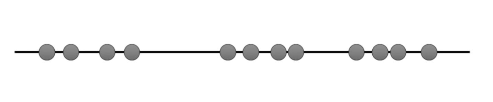
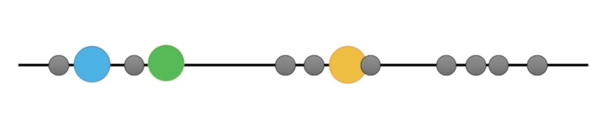
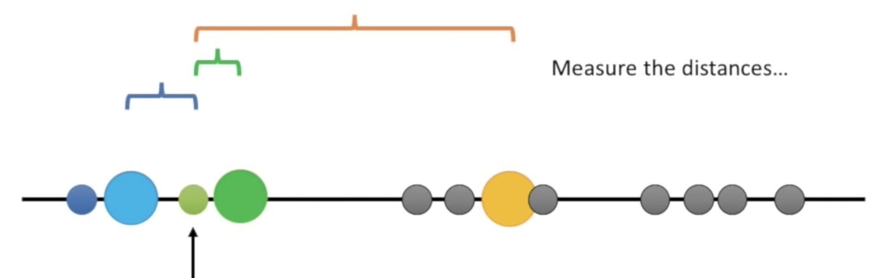
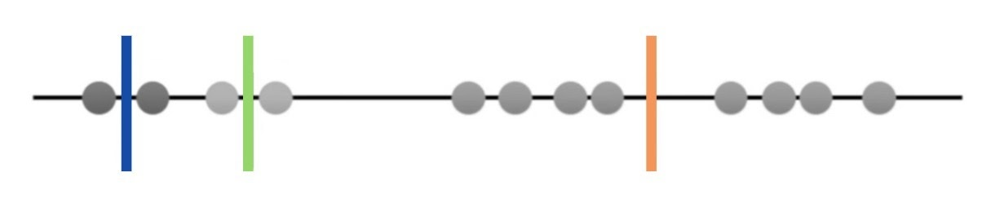
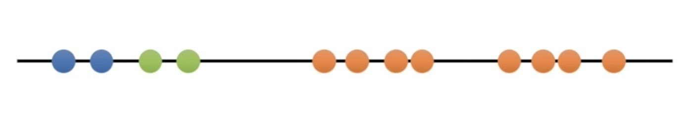
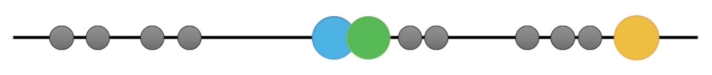
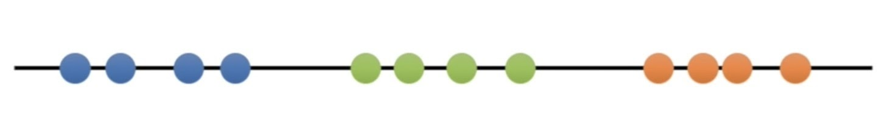
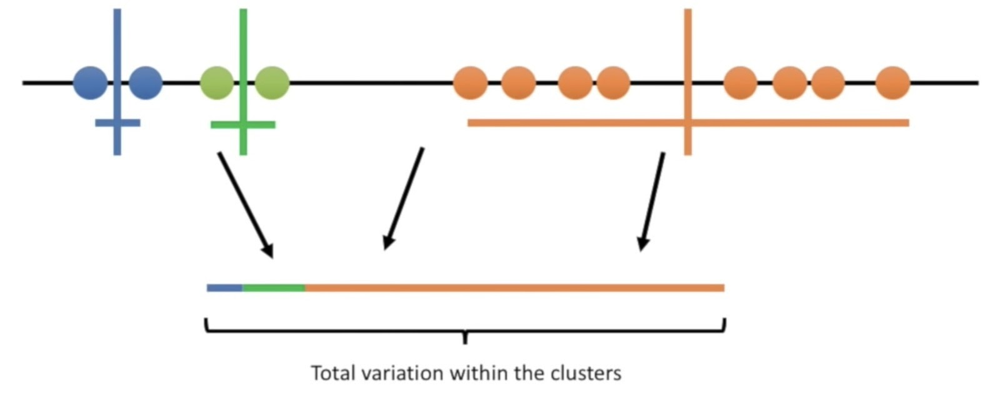
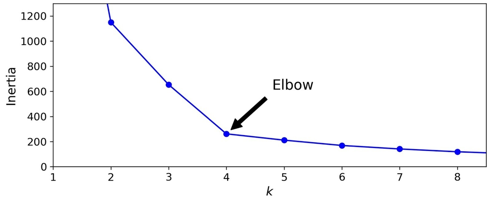

# Unsupervised

Setelah kita memberikan sekumpulan data tanpa label, model machine learning akan mempelajari pola dan struktur pada data berdasarkan hubungan atau keterkaitan antar variabel pada data. Model kemudian akan mengelompokkan data ini ke dalam beberapa klaster yang berbeda. Teknik ini disebut sebagai clustering. 

Beberapa algoritma unsupervised learning yang penting untuk Anda ketahui adalah: 
- clustering, 
- dimensionality reduction, 
- anomaly detection
- density estimation.

## Clustering

Clustering atau pengklasteran adalah sebuah metode untuk memberi label pada data tanpa bantuan manusia. 

## K-Mean Clustering

Pengklasteran K-Means adalah sebuah metode yang dikembangkan oleh Stuart Lloyd dari Bell Labs pada tahun 1957. Lloyd menggunakan metode ini untuk mengubah sinyal analog menjadi sinyal digital. Proses pengubahan sinyal ini juga dikenal sebagai Pulse Code Modulation. 

Untuk melihat bagaimana K-Means bekerja, kita akan menggunakan ilustrasi dari tulisan M. Benbihi. Perhatikan bahwa data yang kita gunakan terdapat 12 sampel dan data ini merupakan data 1 dimensi.

Hal yang paling pertama K-Means lakukan adalah memilih sebuah sampel secara acak untuk dijadikan centroid. Centroid adalah sebuah sampel pada data yang menjadi pusat dari sebuah klaster. Kita bisa melihat pada gambar bahwa 3 sampel yang dijadikan centroid diberi warna biru, hijau dan kuning.

Kedua, karena centroid adalah pusat dari sebuah klaster, setiap sampel akan masuk ke dalam klaster. Ini bermula dari centroid terdekat dengan sampel tersebut. Pada contoh di bawah, sampel yang ditunjuk anak panah memiliki jarak terdekat dengan centroid warna hijau. Alhasil, sampel tersebut masuk ke dalam klaster hijau.

Berikut adalah hasil tahap kedua selesai

Ketiga, setelah setiap sampel dimasukkan pada klaster dari centroid terdekat, K-Means akan menghitung rata-rata dari setiap sampel dan menjadikan rata-rata tersebut sebagai centroid baru. Rata-rata di sini adalah titik tengah dari setiap sampel pada sebuah klaster. Pada gambar dibawah, rata-rata yang menjadi centroid baru digambarkan sebagai garis tegak lurus.

Keempat, langkah kedua diulang kembali. Sampel dengan dimasukkan ke dalam klaster dari centroid baru yang paling dekat dengan sampel tersebut.

Pada tahap ini Anda mengulangi langkah ketiga, yaitu menemukan rata-rata dari klaster terbaru. Anda akan menemukan rata-rata tiap klaster di tahap keempat akan sama dengan rata-rata tiap klaster pada tahap ketiga sehingga centroidnya tidak berubah. Ketika centroid baru tidak ditemukan, maka proses clustering berhenti.

Apakah prosessnya telah selesai? Seperti yang bisa kita lihat ini, hasil pengklasteran dari tahapan sebelumnya belum terlihat optimal.

Untuk mengukur kualitas dari pengklasteran, K-Means akan melakukan iterasi lagi dan mengulangi lagi tahap pertama yaitu memilih sampel secara acak untuk dijadikan centroid. Gambar di bawah menunjukkan K-Means pada iterasi kedua mengulangi kembali langkah pertama yaitu memilih centroid secara acak.

Untuk iterasi kedua, Anda bisa mempraktekkan langkah yang sudah dijelaskan sebelumnya untuk menguji pemahaman Anda. Hasil dari iterasi kedua adalah sebagai berikut.

Hasil dari iterasi kedua terlihat lebih baik dibanding iterasi pertama. Untuk membandingkan klaster setiap iterasi, K-Means akan menghitung variance dari tiap iterasi. Variance adalah persentase jumlah sampel pada tiap klaster. Gambar di bawah menunjukkan variance pada iterasi pertama.

Kita bisa melihat bahwa di iterasi kedua, variance nya lebih seimbang dan tidak condong pada klaster tertentu. Sehingga, hasil dari klaster iterasi kedua lebih baik dari iterasi pertama. Jumlah iterasi dari K-Means ditentukan oleh programmer, dan K-Means akan berhenti melakukan iterasi sampai batas yang telah ditentukan.

Untuk data yang memiliki 2 dimensi atau lebih, k-means bekerja dengan sama yaitu menentukan centroid secara acak, lalu memindahkan centroid sampai posisi centroid tidak berubah. Animasi di bawah akan membantu Anda untuk melihat bagaimana K-Means bekerja pada data 2 dimensi.

### Method Elbow

Cara paling mudah untuk menentukan jumlah K atau klaster pada K-means adalah dengan melihat langsung persebaran data. Otak kita bisa mengelompokkan data-data yang berdekatan dengan sangat cepat. Tetapi cara ini hanya bekerja dengan baik pada data yang sangat sederhana.

Ketika masalah clustering lebih kompleks seperti gambar di bawah dan kita bingung menentukan jumlah klaster yang pas, kita bisa menggunakan metode Elbow.

Metode elbow bertujuan untuk menentukan elbow, yaitu jumlah K yang optimal. Untuk menentukan elbow, kita perlu melakukannya secara manual, yaitu dengan melihat titik dimana penurunan inersia tidak lagi signifikan. 

Kita akan mengaplikasikan metode elbow pada data di atas. Elbow berada di nilai K sama dengan 4, karena penurunan inersia pada K seterusnya tidak lagi signifikan (perubahannya nilainya kecil). Sehingga jumlah klaster yang optimal adalah 4.

Selamat! Anda sudah paham bagaimana K-Means bekerja. Sekarang kita akan belajar menggunakan K-Means dengan library SKLearn.

Exercises:
1. [K-learn](./exercise/9.k-learn.py)
