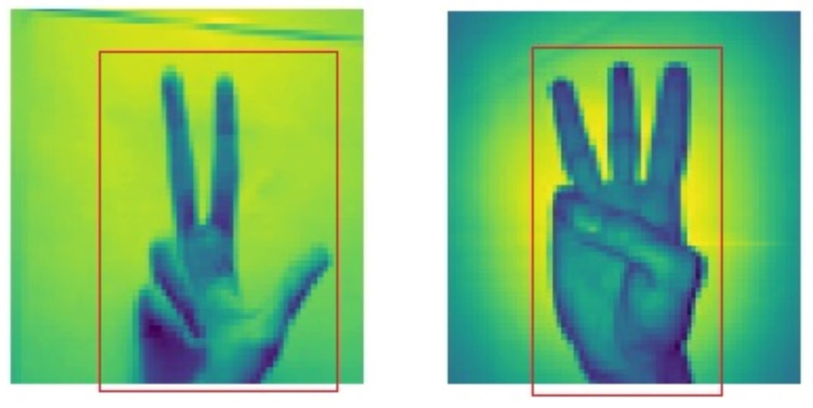

# Dimensionality Reduction: LDA, PCA, t-SNE

Untuk image recognition dengan image 28x28 pixel memiliki 784 atribute, untuk mempercepat train model. Umumnya pada model ML kita akan mengurangi dimensi model dengan membuang pixel atau atribute yang tidak diperlukan.

Pada 2 gambar di atas, setiap pixel adalah sebuah atribut. Hanya atribut yang berada di dalam kotak merah, yang berguna untuk dipakai dalam pelatihan model ML. 

## PCA - Principal Component Analysis

Secara sederhana, tujuan dari PCA adalah mengurangi jumlah atribute pada dataset tanpa mengurangi infromasi.

PCA menghapus atribute yang tidak terlalu mempengaruhi output.

PCA bekerja dengan menghitung variance dari tiap atribut. Variance adalah informasi yang dimiliki sebuah atribut. Misal pada dataset rumah, atribut jumlah kamar memiliki variance atau informasi sebesar 96% dan warna rumah memiliki variance/informasi sebesar 4% tentang harga rumah terkait. Dari hasil perhitungan variance, atribut warna rumah dapat dibuang dari dataset karena tidak memiliki informasi yang cukup signifikan ketika kita ingin mempercepat pelatihan sebuah model.

## LDA - Linear Discriminant Analysis

LDA adalah teknik statiska yang dipakai untuk reduksi dimensi.

LDA bekerja dengan mencari kombinasi atribut terbaik yang dapat memisahkan kelas-kelas pada dataset dan meminimalkan varian pada masing-masing kelas. Kontras dengan PCA yang bekerja dengan mencari atribut komponen yang memiliki varian tertinggi.

Perbedaan mendasar lain yang membedakan LDA dan PCA adalah PCA merupakan teknik unsupervised karena pada pengurangan dimensi, PCA tidak menghiraukan label yang terdapat pada dataset. Sedangkan LDA merupakan teknik supervised karena LDA memperhatikan bagaimana kelas-kelas pada data dapat dipisahkan dengan baik. 

Dengan demikian, dua kriteria utama yang digunakan LDA untuk membuat sumbu baru adalah.

1. Meminimalkan varian pada masing-masing kelas.
2. Memaksimalkan jarak antara rata-rata (mean) kedua kelas.

Secara sederhana, berikut adalah contoh ilsutrasi bagaimana LDA menggunakan dua kriteria di atas atau mereduksi dimensi.

Pada kedua gambar diatas, tampak bahwa sumbu baru yang berwarna merah telah dibuat dan diplot di grafik 2D sedemikian rupa sehingga memaksimalkan jarak antara rata-rata (mean) dari kedua kelas dan meminimalkan varian dari setiap kelas. Dengan kata lain, sumbu ini meningkatkan pemisahan titik-titik data dari kedua kelas. Setelah membuat sumbu baru dengan kriteria yang telah disebutkan di atas, semua titik-titik data kemudian diplot pada sumbu baru seperti tampak pada gambar di sebelah kanan.

## t-SNE

[Orignal paper](http://jmlr.csail.mit.edu/papers/volume9/vandermaaten08a/vandermaaten08a.pdf)

t-Distributed Stochastic Neighbor Embedding atau TSE dikembangkan oleh Laurens va der Maaten dan Geoffrey Hinton pada tahun 2008.

t-SNE menghitung ukuran kesamaan antara pasangan titik data di ruang berdimensi tinggi dan dimensi rendah, kemudian mengoptimalkan dua kesaman ini. Dengan kata lain, t-SNE mengurangi dimesi dengan menjaga sampel-sampel yang mirip agar berdekatan, dan sebaliknya, sampel-sampel yang kurang mirip, berjauhan.

Code exerceises:

1. [SNE](../algorithm/sne)
2. [PCA](exercise/10.pca.py)

