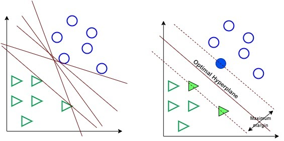
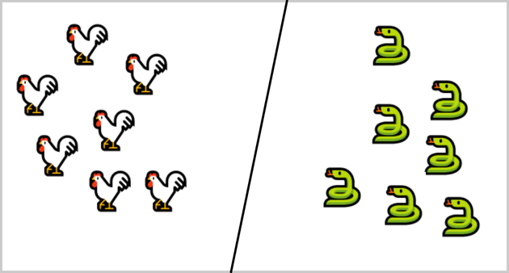
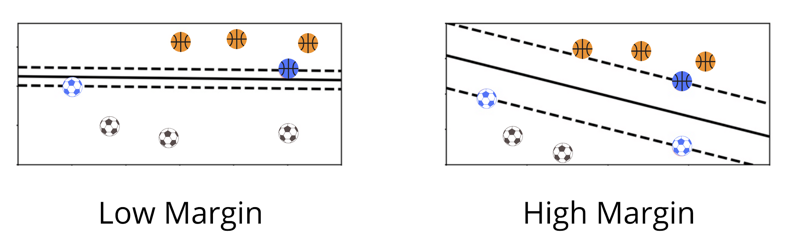

# Support Vector Machine

Support Vector Machine adalah  algoritma training yang bertujuan untuk memaksimalkan margin antara pola pelatihan dan batas keputusan (decision boundary).

SVM adalah model ML multifungsi yang dapat digunakan untuk menyelesaikan permasalahan klasifikasi, regresi, dan pendeteksian outlier.

Tujuan dari algoritma SVM adalah untuk menemukan hyperplane terbaik dalam ruang berdimensi-N (ruang dengan N-jumlah fitur) yang berfungsi sebagai pemisah yang jelas bagi titik-titik data input. Untuk lebih jelasnya, perhatikan gambar berikut.

Gambar di sebelah kiri menunjukkan beberapa kemungkinan bidang (hyperplane) untuk memisahkan data lingkaran dan data kotak. Algoritma SVM kemudian mencari hyperplane terbaik yang dapat memisahkan kedua kelas secara optimal. Seperti tampak pada gambar di sebelah kanan, sebuah hyperplane optimal berhasil dibuat dan mampu memisahkan kedua kelas sehingga memiliki margin yang maksimal.

Beberapa keunggulan Support Vector Machine antara lain:

1. SVM efektif pada data berdimensi tinggi (data dengan jumlah fitur atau atribut yang sangat banyak).

2. SVM efektif pada kasus di mana jumlah fitur pada data lebih besar dari jumlah sampel.

3. SVM menggunakan subset poin pelatihan dalam fungsi keputusan (disebut support vector) sehingga membuat penggunaan memori menjadi lebih efisien.                 

Pada modul ini kita akan belajar tentang bagaimana Support Vector Machine dapat menyelesaikan permasalahan klasifikasi dan regresi.

## Support Vector Machine Classifier

Pada model Classifier SVM dapat membedakan dua object dengan membuat decision boundary atau sebuah bidang yang mampu memisahkan dua buah kelas. Pada masalah ini decision boundary yang mampu memisahkan kelas ayam dan kelas ular adalah sebuah garis lurus yang dapat dilihat pada gambar.

Pertama SVM mencari support vector pada setiap kelas. Support vector adalah sampel dari masing-masing kelas yang memiliki jarak paling dekat dengan sampel kelas lainnya. Pada contoh dataset bola basket dan bola kaki di bawah, support vector adalah bola basket dan bola kaki yang memiliki warna biru. 

Setelah support vector ditemukan, SVM menghitung margin. Margin bisa kita anggap sebagai jalan yang memisahkan dua kelas. Margin dibuat berdasarkan support vector di mana support vector bekerja sebagai batas tepi jalan, atau sering kita kenal sebagai bahu jalan. SVM mencari margin terbesar atau jalan terlebar yang mampu memisahkan kedua kelas.

Pada dataset bola basket dan bola kaki di atas SVM akan memilih margin di sebelah kanan karena ‘jalan’ atau margin pada gambar sebelah kanan lebih lebar dari ‘jalan’ di sebelah kiri. Oleh karena itu, gambar sebelah kanan disebut sebagai high margin classification dan gambar di sebelah kiri disebut low margin classification.

Kembali lagi ke kasus klasifikasi ayam dan ular, sampel ayam dan ular yang berada dalam lingkaran merah adalah support vector. Kemudian kita mencari jalan terlebar dari 2 support vector. Setelah menemukan jalan terlebar, decision boundary lalu digambar berdasarkan jalan tersebut.

Decision boundary adalah garis yang membagi jalan atau margin menjadi 2 bagian yang sama besar. Hyperplane adalah bidang yang memisahkan kedua kelas, sedangkan margin adalah lebar ‘jalan’ yang membagi kedua kelas.

## SVM Klasifikasi non Linier

Pada data non-linear, decision boundary yang dihitung algoritma SVM bukan berbentuk garis lurus. Meski cukup rumit dalam menentukan decision boundary pada kasus ini, tapi kita juga mendapatkan keuntungan, yaitu, bisa menangkap lebih banyak relasi kompleks dari setiap data poin yang tersebar.

Untuk data seperti di atas, Support Vector Classifier menggunakan sebuah metode yaitu “kernel trick” sehingga data dapat dipisahkan secara linier. Apa itu trik kernel? Ia adalah sebuah metode untuk mengubah data pada dimensi tertentu (misal 2D) ke dalam dimensi yang lebih tinggi (3D) sehingga dapat menghasilkan hyperplane yang optimal. Perhatikan gambar berikut.
