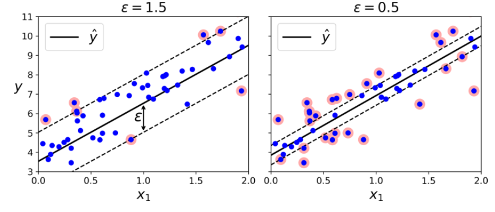

# Support Vector Regression

Support Vector Regression (SVR) akan mencari jalan yang dapat menampung sebanyak mungkin sampel di 'jalan'

Ukuran performa untuk permasalahan regresi linear adalah Root Mean Square Error (RMSE). RMSE memberi gambaran tentang seberapa banyak kesalahan dalam prediksi yang dibuat oleh sistem. Tujuannya tentu saja untuk mendapatkan eror atau tingkat kesalahan seminimal mungkin. 

Ada tiga jenis implementasi Support Vector Regression pada scikit-learn yaitu: SVR, NuSVR, dan LinearSVR. 

Implementasi dari LinearSVR lebih cepat dari SVR tetapi hanya dapat digunakan untuk kernel linear, sedangkan NuSVR mengimplementasikan formula yang sedikit berbeda dari SVR dan LinearSVR. NuSVR menggunakan parameter nu untuk mengontrol jumlah support vector. 

Jika tertarik untuk lebih memahami bagaimana implementasi SVR pada scikit-learn, Anda bisa mengunjungi tautan berikut: 
- [SVR](https://scikit-learn.org/stable/modules/generated/sklearn.svm.SVR.html#sklearn.svm.SVR)
- [NuSVR](https://scikit-learn.org/stable/modules/generated/sklearn.svm.NuSVR.html#sklearn.svm.NuSVR), dan 
- [LinearSVR](https://scikit-learn.org/stable/modules/generated/sklearn.svm.LinearSVR.html#sklearn.svm.LinearSVR).
